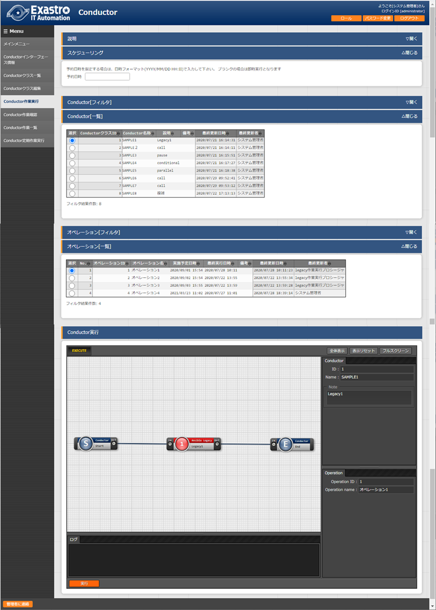
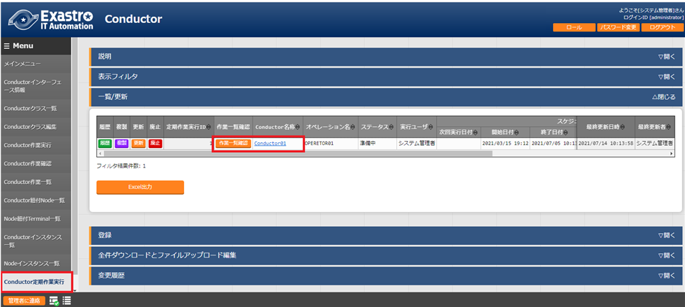
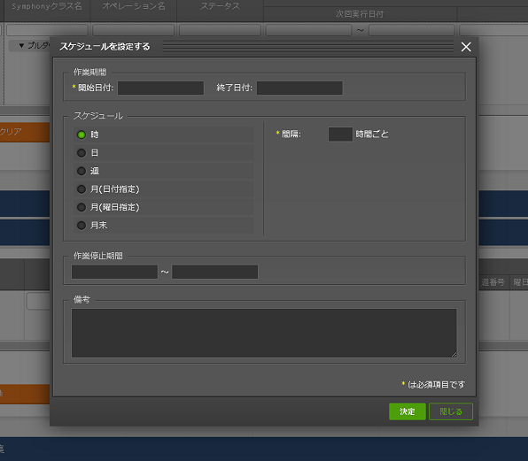
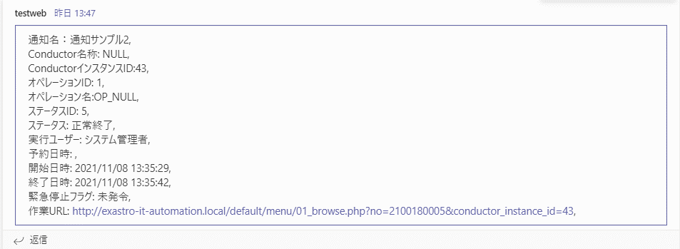
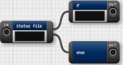
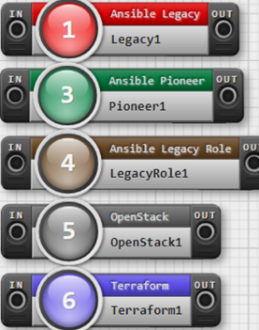
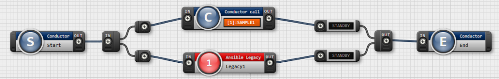

=========
Conductor
=========
.. figure:: ./conductor/image2.png
   :alt: Exastro
   :width: 400px

はじめに
========

本書は、ITAのConductorの機能および操作方法について説明します。

ITA Conductorの概要
===================

| 本章ではConductorメニューの機能、操作方法について説明します。
| Conductorでは、ITAを利用して作業を行う上で共通に必要となる以下の機能を提供します。

ITA Conductorのメニュー、画面構成
=================================

| 本章では、ITA Conductorのメニュー、画面構成について説明します

ITA Conductorメニュー 一覧
--------------------------

| ITA共通/Conductorのメニューを以下に示します。

.. table:: ITA Conductor画面一覧
   :align: left

   +--------+----------------------+------------------+---------------------------------------------+
   | **No** | **メニューグループ** | **メニュー**     | **説明**                                    |
   |        |                      |                  |                                             |
   |        |                      |                  |                                             |
   |        |                      |                  |                                             |
   |        |                      |                  |                                             |
   |        |                      |                  |                                             |
   |        |                      |                  |                                             |
   +========+======================+==================+=============================================+
   | 1      | Conductor            | Conductorイン\   | Conductor作業実行時のMovemen\               |
   |        |                      | ターフェース情報 | tで共有するディレクトリパスなどをメン       |
   |        |                      |                  | テナンス(閲覧/登録/更新/廃止)できます。     |
   +--------+----------------------+------------------+---------------------------------------------+
   | 2      |                      | Con\             | Conductorク\                                |
   |        |                      | ductorクラス一覧 | ラスをメンテナンス(閲覧/廃止)できます。     |
   |        |                      |                  |                                             |
   |        |                      |                  | 「詳細」をクリックするとCo\                 |
   |        |                      |                  | nductorクラス編集メニューに遷移します。     |
   +--------+----------------------+------------------+---------------------------------------------+
   | 3      |                      | Con\             | Conductorクラスを編集できます。             |
   |        |                      | ductorクラス編集 |                                             |
   +--------+----------------------+------------------+---------------------------------------------+
   | 4      |                      | C\               | Conductor作業を実行できます。               |
   |        |                      | onductor作業実行 |                                             |
   +--------+----------------------+------------------+---------------------------------------------+
   | 5      |                      | C\               | Conductor作業の実行結果を確認できます。     |
   |        |                      | onductor作業確認 |                                             |
   +--------+----------------------+------------------+---------------------------------------------+
   | 6      |                      | C\               | Conductor一覧(実行履歴)を閲覧できます。     |
   |        |                      | onductor作業一覧 |                                             |
   |        |                      |                  | 「詳細」をクリッ\                           |
   |        |                      |                  | クするとConductor作業確認に遷移します。     |
   +--------+----------------------+------------------+---------------------------------------------+
   | 7      |                      | Condu\           | スケジュールに従って定期的\                 |
   |        |                      | ctor定期作業実行 | に実行するConductor作業を管理します。       |
   +--------+----------------------+------------------+---------------------------------------------+

ITA Conductor利用手順
=====================

作業フロー
----------

| ITA Conductorにおける標準的な作業フローは以下のとおりです。
| 各作業の詳細は次項に記載しています。
| 
* 「機器情報」、「オペレーション」の登録方法については、「利用手順マニュアル　基本コンソール」を参照してください。
* Movementの登録方法については、各Driverの利用手順マニュアルを参照してください。 
* | Conductor実行時の各 Movementで共有するディレクトリパスが利用可能です。
  | Movement間で情報伝達する必要がある場合、共有するディレクトリパスを利用する事で情報の受け渡しが可能となります。
  | 共有対象については、「Ansible driver」と「Terraformdriver」を対象としています。
  | 「Ansible driver」に関する詳細は、別紙、「利用手順マニュアルAnsible-driver」を参照してください。
  | 「Terraform driver」に関する詳細は、別紙、「利用手順マニュアルTerraform-driver」を参照してください。
* 「Conductor call」,「Symphony call」で実行した作業フローについては、それぞれ個別に共有ディレクトリパスを持ちます。（作業フローを跨いでいるMovemetについては、共有の対象外となります。）

   作業フロー

機能・操作方法説明
==================

ITA Conductor
-------------

Conductorインターフェース情報
~~~~~~~~~~~~~~~~~~~~~~~~~~~~~

#. 「Conductorインターフェース情報」メニューでは、Conductorから実行される各Movementで共有するディレクトリのパスと「Conductor作業確認」メニューのリフレッシュ間隔を設定します。

   .. figure:: ./conductor/image3.png
      :width: 800px
      :alt: 「Conductorインターフェース情報」メニュー

      「Conductorインターフェース情報」メニュー

#. 「Conductorインターフェース情報」メニュー >「一覧」サブメニューの詳細は以下のとおりです。

   .. table:: 「一覧」サブメニュー
      :align: left

      +-----------------------------+----------------------------------------------------------------------------------------------------------------------------+----------+-----------+-------------------+
      | 項目                        | 説明                                                                                                                       | 入力必須 | 入力形式  | 制約事項          |
      +=============================+============================================================================================================================+==========+===========+===================+
      | データリレイストレージパス  |  Conductor 実行時、各 Movement で共有するディレクトリを、ITA サーバから見たディレクトリパスで入力します。                  |  ○       | 手動入力  | 最大長128バイト   |
      |                             |                                                                                                                            |          |           |                   |
      |                             |  Ansible、Ansible-Tower サーバから見たパスは、Ansible-Driver の利用手順マニュアルのインターフェース情報を参照して下さい。\ |          |           |                   |
      |                             |  Terraform との連携は共有ディレクトリをせずにREST APIで情報を取得するため、\                                               |          |           |                   |
      |                             |  Terraform-Driverではこのディレクトリパスが直接使用されます。                                                              |          |           |                   |
      +-----------------------------+----------------------------------------------------------------------------------------------------------------------------+----------+-----------+-------------------+
      |  状態監視周期（単位ミリ秒） |  「4.1.5 Conductor 作業実行」の表示をリフレッシュする間隔を入力します。通常は3000ミリ秒程\                                 |  ○       | 手動入力  | 最小値1000ミリ秒  |
      |                             |  度が推奨値です。                                                                                                          |          |           |                   |
      +-----------------------------+----------------------------------------------------------------------------------------------------------------------------+----------+-----------+-------------------+
      | 備考                        | 自由記述欄です。                                                                                                           | -        | 手動入力  | -                 |
      +-----------------------------+----------------------------------------------------------------------------------------------------------------------------+----------+-----------+-------------------+

Conductorクラス一覧
~~~~~~~~~~~~~~~~~~~

#. 「Conductorクラス一覧」メニューでは、登録済みのConductorクラスを参照/廃止できます。

   | 「一覧」サブメニューの「詳細」ボタンをクリックすると、その :ref:`editconductorclass` 画面へ遷移できます。

   「Conductorクラス一覧」メニュー

.. _editconductorclass:
Conductorクラス編集
~~~~~~~~~~~~~~~~~~~

「Conductorクラス編集」メニューについて
***************************************

.. table:: モード一覧
   :align: left

   +------------+---------------------------------------------------------------------------------+
   | **モード** | **説明**                                                                        |
   |            |                                                                                 |
   |            |                                                                                 |
   +============+=================================================================================+
   | EDIT       | * Conductorクラスを編集できるモード                                             |
   |            |                                                                                 |
   |            | * 「Conductorクラス編集」メニューのデフォルトのモード                           |
   |            |                                                                                 |
   |            | * EDITモードから「登録」ボタン/「更新」ボタン押下後に、VIEWモードへ変更         |
   |            |                                                                                 |
   +------------+---------------------------------------------------------------------------------+
   | VIEW       | * Conductorクラスを閲覧のみできるモード                                         |
   |            |                                                                                 |
   |            | * 「Conductorクラス一覧」メニューの「詳細」ボタンから画面遷移後のモード         |
   |            |                                                                                 |
   |            |                                                                                 |
   |            | * VIEWモードから「編集」ボタン押下後に、EDITモードへ変更                        |
   +------------+---------------------------------------------------------------------------------+

| 各モードで可能な操作については「\ **表 4.1-18「Conductorクラス編集」メニュー実行操作一覧**\ 」を参照。

* 選択したNodeにより、「B）詳細情報」に表示される内容が変わります。
  

   「Conductorクラス編集」メニュー（モード：EDIT）

Node一覧
^^^^^^^^

* 画面右側下部の領域には、利用可能なNodeが表示されます。
* 以下のタブから構成されます。

  * Movementタブ
  
    * 登録済みのMovementのIDと名称の一覧

  * Functionタブ
  
    * Conductor end
    * Conductor pause
    * Conductor call
    * Symphony call
    * Conditional branch
    * Parallel branch
    * Parallel merge
    * Status File branch

* 各Nodeについて、詳細は以下の通りです。

.. table:: Node一覧
   :align: left

   +----------------+------------------------------+-----------------------------------+
   | **画像**       | **名称**                     | **動作説明**                      |
   +================+==============================+===================================+
   | |image1|       | Conductor start              | Conductorを開始します             |
   +----------------+------------------------------+-----------------------------------+
   | |image2|       | Conductor end                | Conductor終了します。             |
   |                |                              |                                   |
   |                |                              | ※複数のConductor\                 |
   |                |                              | endがある場合、全てのConductor\   |
   |                |                              | endが終了を待ちます。             |
   +----------------+------------------------------+-----------------------------------+
   | |image3|       | Conductor pause              | ワークフローを一時停止します。    |
   |                |                              |                                   |
   |                |                              | 一時停止を\                       |
   |                |                              | 解除すると、次の処理へ進みます。  |
   +----------------+------------------------------+-----------------------------------+
   | |image4|       | Conductor call               | 別の登録済みのCond\               |
   |                |                              | uctorクラスを呼び出し実行します。 |
   |                |                              |                                   |
   |                |                              | ※\                                |
   |                |                              | 呼び出し先のConductorが警告終了で\|
   |                |                              | 終了した場合、正常終了と同じよう\ |
   |                |                              | に後続の処理を実行して、呼び出し\ |
   |                |                              | 元のステータスには影響しません。  |
   +----------------+------------------------------+-----------------------------------+
   | |image5|       | Symphony call                | 登録済みのSym                     |
   |                |                              | phonyクラスを呼び出し実行します。 |
   +----------------+------------------------------+-----------------------------------+
   | |image6|       | Conditional branch           | 接続\                             |
   |                |                              | された、「Movement」、「Conductor\|
   |                |                              | call」、「Symphony\               |
   |                |                              | call」の結果によ\                 |
   |                |                              | って、後続の処理を分岐させます。  |
   |                |                              |                                   |
   |                |                              | 指定可能\                         |
   |                |                              | なステータスは、以下になります。  |
   |                |                              |                                   |
   |                |                              | ・正常終了                        |
   |                |                              |                                   |
   |                |                              | ・異常終了                        |
   |                |                              |                                   |
   |                |                              | ・緊急停止                        |
   |                |                              |                                   |
   |                |                              | ・準備エラー                      |
   |                |                              |                                   |
   |                |                              | ・想定外エラー                    |
   |                |                              |                                   |
   |                |                              | ・SKIP完了                        |
   |                |                              |                                   |
   |                |                              | ・警告終了                        |
   +----------------+------------------------------+-----------------------------------+
   | |image7|       | Parallel branch              | 並\                               |
   |                |                              | 列して、「Movement」、「Conductor\|
   |                |                              | call」、「Symphony\               |
   |                |                              | call」を実行します。              |
   |                |                              |                                   |
   |                |                              | ※並列可能な実行数は、ITAの構成\   |
   |                |                              | やサーバースペックに依存します。  |
   +----------------+------------------------------+-----------------------------------+
   | |image8|       | Parallel merge               | 接続している全Nodeの処理\         |
   |                |                              | が完了後、次の処理を実行します。  |
   +----------------+------------------------------+-----------------------------------+
   | |image9|       | Status file branch           | 接続された、「\                   |
   |                |                              | Movement」の作業結果ディレクトリ\ |
   |                |                              | 内のステータスファイルの内容によ\ |
   |                |                              | って、後続の処理を分岐させます。  |
   +----------------+------------------------------+-----------------------------------+
   | |image10|      | Movement各種                 | Movementを実行します。            |
   +----------------+------------------------------+-----------------------------------+

* Nodeにおける制約事項は以下の通りです。

  * 登録/更新を行うには、全てのNodeのIN/OUTが接続されている必要があります。
  .. figure:: ./conductor/image17.png
      :width: 600px
      :alt: Node制約事項（正常例：Parallel branch）

      Node制約事項（正常例：Parallel branch）

  * Parallel mergeを使用する場合、Parallel branchを使用している必要があります。
  .. figure:: ./conductor/image18.png
     :width: 600px
     :alt: Node制約事項（NG例：Parallel branch）

     Node制約事項（NG例：Parallel branch）

  * Conditional branch で分岐されたフローについてParallel mergeでマージする事はできません。
  .. figure:: ./conductor/image19.png
     :width: 600px
     :alt: Node制約事項（NG例：Conditional branch）

     Node制約事項（NG例：Conditional branch）

  * Parallel branch、Conditional branch、Parallel merge、Conductor pauseについて、連続して同じ種類のNodeを接続する事はできません。
  .. figure:: ./conductor/image20.png
     :width: 600px
     :alt: Node制約事項（NG例：連続使用）

     Node制約事項（NG例：連続使用）

  * Conductor callについて、更新中のConductorをConductor callで指定し、更新することはできません。
  .. figure:: ./conductor/image21.png
     :width: 600px
     :alt: Node制約事項（NG例：Conductor call）

     Node制約事項（NG例：Conductor call）

  * 各NodeをNode一覧からドラッグ&ドロップで追加することが可能です。

  * Node選択時「B）詳細情報」に表示される「Note」欄には、処理説明やコメントをメモすることが可能です。

  * 「Note」欄の記述は処理実行に影響はありません。Web上でのみ参照できるメモ欄です。

  * Node設定後、「登録」ボタンを押下してConductorクラスを登録します

詳細情報
^^^^^^^^
* 画面右側上部の領域には、選択しているNodeの詳細情報が表示されます。
* 選択しているNodeによってタブの名称が変わります。

#. 「Conductor名称」タブ

   *  Node未選択の場合表示されます。

   *  タブ内の項目は以下の通りです。

   .. list-table:: 「Conductor名称」タブ
      :widths: 5 30 5 5 5
      :header-rows: 1
      :align: left
      
      * - **項目**
        - **説明**
        - **入力必須**
        - **入力形式**
        - **制約事項**
      * - ID
        - Conductorに対応 した一意のIDが自動採番されます。
        - \-
        - 自動入力
        - \-
      * - Name 
        - | 任意のConductorクラス名称を入力します。
          | 各ステータスに対して、実行する通知を複数選択できます。
        - ○
        - 手動入力
        - \-
      * - Notice 
        - 実行する通知を選択します。
        - \-
        - 選択
        - ※
      * - Role 
        - | このConductor へアクセス可能なロールを選択します。
          | ロールが1つも選択されていない場合は、すべてのロールがアクセス可能となります。
          | 「Permission role select」ボタンを押下して表示される一覧から任意の値を選択できます。
        - \-
        - 選択
        - \-
      * - Note 
        - Conductorクラスに対する説明やコメントを入力します。
        - \-
        - 手動入力
        - \-

   .. figure:: ./conductor/image22.png
      :width: 500px
      :alt: 「Conductor」名称タブ

      「Conductor」名称タブ

   .. figure:: ./conductor/image23.png
      :width: 500px
      :alt: 「Notice」のポップアップ

      「Notice」のポップアップ

   .. figure:: ./conductor/image24.png
      :width: 500px
      :alt: 「Permission role」のポップアップ

      「Permission role」のポップアップ

#. 「Movement」タブ

   * 「A）Node一覧」における「Movement」タブ内のNodeを選択した場合表示されます。
   * タブ内の項目は以下の通りです。

   .. list-table:: 「Movement」タブ
      :widths: 10 30 5 5 5
      :header-rows: 1
      :align: left
      
      * - **項目**
        - **説明**
        - **入力必須**
        - **入力形式**
        - **制約事項**
      * - Movement ID
        - 選択したMovementのIDが表示されます。
        - \-
        - 自動入力
        - \-
      * - Orchestrator
        - 選択したMovementのオーケストレータ名が表示されます。
        - \-
        - 自動入力
        - \-
      * - Name
        - 選択したMovementの名称が表示されます。
        - \-
        - 自動入力
        - \-
      * - Default slip
        - 対象作業をスキップする場合にチェックします。「Conductor 作業実行」メニューにて、変更可能なパラメータです。
        - \-
        - 手動入力
        - \-
      * - Operation
        - |「Select」ボタンを押下して表示される一覧から任意の値を選択できます。
          | 選択したオペレーション名が表示されます。
        - \-
        - 選択
        - \-
      * - Note
        - Nodeに対する説明やコメントを入力できます。
        - \-
        - 手動入力
        - \-

   .. figure:: ./conductor/image25.png
      :width: 500px
      :alt: 「Movement」タブ

      「Movement」タブ

   .. figure:: ./conductor/image26.png
      :width: 500px
      :alt: 「Operation select」のポップアップ

      「Operation select」のポップアップ

#. 「Function」タブ

   * 「Node一覧」における「Function」タブ内の「Conductorstart」「Conductor end」「Conductor pause」を選択した場合表示されます。
   * タブ内の項目は以下の通りです。

   .. list-table:: 「Function」タブ
      :widths: 10 30 5 5 5
      :header-rows: 1
      :align: left
      
      * - **項目**
        - **説明**
        - **入力必須**
        - **入力形式**
        - **制約事項**
      * - Type
        - 選択したNodeのタイプが表示されます。
        - \-
        - 自動入力
        - \-
      * - Note
        - Nodeに対する説明やコメントを入力できます。
        - \-
        - 手動入力
        - \-

   .. figure:: ./conductor/image27.png
      :width: 500px
      :alt: 「Functionタブ」

      「Functionタブ」

#. 「Conductor call」タブ

   * 「A）Node一覧」における「Function」タブ内の「Conductorcall」を選択した場合表示されます。
   * タブ内の項目は以下の通りです。

   .. list-table:: 「Function」タブ
      :widths: 10 30 5 5 5
      :header-rows: 1
      :align: left
      
      * - **項目**
        - **説明**
        - **入力必須**
        - **入力形式**
        - **制約事項**
      * - Default skip
        - | 対象作業をスキップする場合にチェックします。
          | Conductor作業実行画面にて、変更可能なパラメータです。
        - \-
        - 手動入力
        - \-
      * - Conductor
        - | 「Conductor Select」ボタンを押下して表示される一覧からConductorを選択できます。
          | 選択したConductorクラス名称が表示されます。
        - \-
        - 選択
        - \-
      * - Operation
        - | 「Conductor Select」ボタンを押下して表示される一覧から、任意のオペレーションを選択できます。
          | 指定したオペレーション名が表示されます。
        - \-
        - 選択
        - \-
      * - Note
        - Nodeに対する説明やコメントを入力できます。
        - \-
        - 手動入力
        - \-

   .. figure:: ./conductor/image28.png
      :width: 500px
      :alt: 「Conductor call」タブ

      「Conductor call」タブ

   .. figure:: ./conductor/image29.png
      :width: 500px
      :alt: 「Conductor select」のポップアップ

      「Conductor select」のポップアップ

#. 「Symphony call」タブ

   * 「Node一覧」における「Function」タブ内の「Symphonycall」を選択した場合表示されます。
   * タブ内の項目は以下の通りです。

   .. list-table:: 「Function」タブ
      :widths: 10 30 5 5 5
      :header-rows: 1
      :align: left
      
      * - **項目**
        - **説明**
        - **入力必須**
        - **入力形式**
        - **制約事項**
      * - Default skip
        - | 対象作業をスキップする場合にチェックします。
          | Conductor作業実行画面にて、変更可能なパラメータです。
        - \-
        - 手動入力
        - \-
      * - Symphony
        - | 「Symphony Select」ボタンを押下して表示される一覧からSymphonyを選択できます。
          | 選択したSymphonyクラス名称が表示されます。
        - \-
        - 選択
        - \-
      * - Operation
        - | 「Operation Select」ボタンを押下して表示される一覧から、任意のオペレーションを選択できます。
          | 指定したオペレーション名が表示されます。
        - \-
        - 選択

   .. figure:: ./conductor/image30.png
      :width: 500px
      :alt: 「Symphony call」タブ

      「Symphony call」タブ

   .. figure:: ./conductor/image31.png
      :width: 500px
      :alt: 「Symphony select」のポップアップ

      「Symphony select」のポップアップ

#. 「Parallel branch」タブ

   * 「Node一覧」における「Function」タブ内の「Parallelbranch」を選択した場合表示されます。
   * タブ内の項目は以下の通りです。

   .. list-table:: 「Parallel branch」タブ
      :widths: 10 30 5 5 5
      :header-rows: 1
      :align: left
      
      * - **項目**
        - **説明**
        - **入力必須**
        - **入力形式**
        - **制約事項**
      * - case
        - | 分岐数を設定します。「Add」ボタン/「Delete」ボタンを押下して、分岐を増減します。
          | デフォルトの分岐数は2です。2以下の値は設定できません。
        - \-
        - 選択
        - \-
      * - Note
        - Nodeに対する説明やコメントを入力できます。
        - \-
        - 手動入力
        - \-

   .. figure:: ./conductor/image32.png
      :width: 500px
      :alt: 「Parallel branch」タブ

      「Parallel branch」タブ

#. 「Conditional branch」タブ

   * 「Node一覧」における「Function」タブ内の「Conditionalbranch」を選択した場合表示されます。
   * タブ内の項目は以下の通りです。
  

   .. table:: 「Conditional branch」タブ
      :align: left

      +------+----------------------------------------------+---------------+---------+---------+
      | **項\| **説明**                                     | **入力形式**  | **入力\ | **制約\ |
      | 目** |                                              |               | 形式**  | 事項**  |
      |      |                                              |               |         |         |
      |      |                                              |               |         |         |
      |      |                                              |               |         |         |
      |      |                                              |               |         |         |
      |      |                                              |               |         |         |
      |      |                                              |               |         |         |
      |      |                                              |               |         |         |
      +======+==============================================+===============+=========+=========+
      | case\| Movement、Conductor                          | -             | 選択    | ※       |
      | (\   | call、Symphony                               |               |         |         |
      | 1-6) | callの実行\                                  |               |         |         |
      |      | 結果による条件分岐を設定します。             |               |         |         |
      |      |                                              |               |         |         |
      |      | ドラッグアン\                                |               |         |         |
      |      | ドドロップで設定を変更できます。             |               |         |         |
      |      |                                              |               |         |         |
      |      | デフォルトは以下の通りです。                 |               |         |         |
      |      |                                              |               |         |         |
      |      | +-----------------+-----------------------+  |               |         |         |
      |      | | **case**        | 正常終了              |  |               |         |         |
      |      | |                 |                       |  |               |         |         |
      |      | |                 |                       |  |               |         |         |
      |      | +=================+=======================+  |               |         |         |
      |      | | **Other**       | 異常\                 |  |               |         |         |
      |      | |                 | 終了、緊急停止、準備\ |  |               |         |         |
      |      | |                 | エラー、想定外エラー\ |  |               |         |         |
      |      | |                 | 、skip完了、警告終了  |  |               |         |         |
      |      | +-----------------+-----------------------+  |               |         |         |
      +------+----------------------------------------------+---------------+---------+---------+
      | Note | Nodeに対す\                                  | -             | 手\     | -       |
      |      | る説明やコメントを入力できます。             |               | 動入力  |         |
      +------+----------------------------------------------+---------------+---------+---------+

   | ※警告終了は、Conductorにのみ対応したステータスとなります。「Movement」、「Symphonycallノード」と「Conditional branch」を接続した場合、警告終了のCaseへの分岐へ進行することはありません。

   .. figure:: ./conductor/image33.png
      :width: 500px
      :alt: 「Conditional branch」タブ

      「Conditional branch」タブ

#. 「Parallel Merge」タブ

   * 「Node一覧」における「Function」タブ内の「Parallel merge」を選択した場合表示されます。
   * タブ内の項目は以下の通りです。

   .. list-table:: 「Merge」タブ
      :widths: 10 30 5 5 5
      :header-rows: 1
      :align: left
      
      * - **項目**
        - **説明**
        - **入力必須**
        - **入力形式**
        - **制約事項**
      * - case
        - | 分岐数を設定します。「Add」ボタン/「Delete」ボタンを押下して、分岐を増減します。
          | デフォルトの分岐数は2です。2以下の値は設定できません。
        - \-
        - 選択
        - \-
      * - Note
        - Nodeに対する説明やコメントを入力できます。
        - \-
        - 手動入力
        - \-

   .. figure:: ./conductor/image34.png
      :width: 500px
      :alt: 「Merge」タブ
      
      「Merge」タブ

#. 「End」タブ

   * 「Node一覧」における「Function」タブ内の「End」を選択した場合表示されます。
   * タブ内の項目は以下の通りです。

   .. list-table:: 「Merge」タブ
      :widths: 10 30 5 5 5
      :header-rows: 1
      :align: left
      
      * - **項目**
        - **説明**
        - **入力必須**
        - **入力形式**
        - **制約事項**
      * - End Status
        - | Endまで処理された際に、選択されたステータスが、Conductorのステータスへ反映されます。
          | - 正常終了 (デフォルト値)  
          | - 警告終了 
          | - 異常終了  
          | 
          | 複数のEndノードまで処理された場合、反映されるステータスの優先度は以下です。
          |  優先度： 正常終了 < 警告終了 < 異常終了
        - \-
        - 選択
        - \-
      * - Note
        - Nodeに対する説明やコメントを入力できます。
        - \-
        - 手動入力
        - \-

   .. figure:: ./conductor/image35.png
      :width: 500px
      :alt: 「End」タブ
      
      「End」タブ

#. 「Status file branch」タブ

   * 「Node一覧」における「Function」タブ内の「Status file branch」を選択した場合表示されます。
   * タブ内の項目は以下の通りです。

   .. list-table:: 「Merge」タブ
      :widths: 10 30 5 5 5
      :header-rows: 1
      :align: left
      
      * - **項目**
        - **説明**
        - **入力必須**
        - **入力形式**
        - **制約事項**
      * - if /elseif
        - | Movement のステータスファイルによる条件分岐を設定します。
          | 「Add」ボタン/「Delete」ボタンを押下して、分岐を増減します。
          | デフォルトの分岐は「if」と「else」です。
        - \-
        - 選択
        - \-
      * - Note
        - Nodeに対する説明やコメントを入力できます。
        - \-
        - 手動入力
        - \-

   .. figure:: ./conductor/image36.png
      :width: 500px
      :alt: 「Status file branch」タブ
      
      「Status file branch」タブ

   .. note:: | **※参照するステータスファイルについて**

    * 参照するステータスファイルは、各Movmentの作業結果ディレクトリ配下の「MOVEMENT_STATUS_FILE」を参照します。
    * ステータスファイルが存在しない場合、「else」側の処理を行います。
    * ステータスファイル内の内容が、複数行（改行コードを含む）場合、改行コード以降は、除外した値を評価対象とします。
    | 例）改行含むステータスファイルの内容

    +-----------------------------------------------------------------------+
    | 1                                                                     |
    |                                                                       |
    | 23                                                                    |
    |                                                                       |
    | 4                                                                     |
    +-----------------------------------------------------------------------+

    | ステータスファイルの内容として、「1」として、評価を行います。

    .. list-table:: ステータスファイルITA独自変数
       :widths: 15 25 5
       :header-rows: 1
       :align: left
        
       * - **ITA独自変数**
         - **変数指定内容**
         - **制約事項**
       * - __movement_status_filepath__ 
         - 作業結果ディレクトリ配下の「MOVEMENT_STATUS_FILE」のパス
         - ※

    ※「Ansible-Legacy」、「Ansible-Pioneer」、「Ansible-LegacyRole」で対応しています。

#. 「Node」タブ

   * 「Node一覧」における「Movement」タブおよび「Function」タブ内のNodeを複数選択した場合表示されます。
   * Nodeを複数選択する方法については、ドラッグアンドドロップでの範囲選択の他、「shift」キーを押下しながらの選択が可能です。
   * タブ内の項目は以下の通りです。

   .. list-table:: 「Node」タブ
      :widths: 10 30 5 5 5
      :header-rows: 1
      :align: left
      
      * - **項目**
        - **説明**
        - **入力必須**
        - **入力形式**
        - **制約事項**
      * - |image11|
        - 複数選択したNodeを左揃えに整列します。
        - \-
        - 選択
        - \-
      * - |image12|
        - 複数選択したNodeを左右中央揃えに整列します。
        - \-
        - 選択
        - \-
      * - |image13|
        - 複数選択したNodeを右揃えに整列します。
        - \-
        - 選択
        - \-
      * - |image14|
        - 複数選択したNodeを上揃えに整列します。
        - \-
        - 選択
        - \-
      * - |image15|
        - 複数選択したNodeを上下中央揃えに整列します。
        - \-
        - 選択
        - \-
      * - |image16|
        - 複数選択したNodeを下揃えに整列します。
        - \-
        - 選択
        - \-
      * - |image17|
        - 複数選択したNodeを左右等間隔にします。
        - \-
        - 選択
        - \-
      * - |image18|
        - 複数選択したNodeを上下等間隔にします。
        - \-
        - 選択
        - \-

   .. figure:: ./conductor/image45.png
      :width: 500px
      :alt: 「Node」タブ
      
      「Node」タブ

   * 「Conductorクラス編集」メニューで実行可能な操作は以下の通りです。

   .. table:: 「Conductorクラス編集」メニュー実行操作一覧

      +-------------+-----------------------------------+----------+---------+---------+------+
      | **項目**    | **説明**                          | **新規** | **更新**          | **備 |
      |             |                                   |          |                   | 考** |
      |             |                                   |          |                   |      |
      |             |                                   |          |                   |      |
      |             |                                   +----------+---------+---------+      |
      |             |                                   | **EDIT** | **VIEW**| **EDIT**|      |
      |             |                                   |          |         |         |      |
      |             |                                   |          |         |         |      |
      |             |                                   |          |         |         |      |
      +=============+===================================+==========+=========+=========+======+
      | 新規        | 初期状態へ戻します。              |  〇      |         |         |      |
      +-------------+-----------------------------------+----------+---------+---------+------+
      | 保存        | 描画されている状\                 | 〇       |         |         |      |
      |             | 態を、ファイル形式で保存します。  |          |         |         |      |
      +-------------+-----------------------------------+----------+---------+---------+------+
      | 読\         | 保存したファイ\                   |   〇     |         |         |      |
      | み込み      | ルを読み込み、状態を復元します。  |          |         |         |      |
      +-------------+-----------------------------------+----------+---------+---------+------+
      | 取\         | 直前の処理を取り消します。        | 〇       |         |  〇     |      |
      | り消し      |                                   |          |         |         |      |
      +-------------+-----------------------------------+----------+---------+---------+------+
      | や\         | 直前の取り消しをやり直します。    | 〇       |         | 〇      |      |
      | り直し      |                                   |          |         |         |      |
      +-------------+-----------------------------------+----------+---------+---------+------+
      | ノー\       | 選択しているNodeを削除します。    | 〇       |         | 〇      |      |
      | ド削除      |                                   |          |         |         |      |
      +-------------+-----------------------------------+----------+---------+---------+------+
      | 登録        | 登録を実施します。                | 〇       |         | 〇      |      |
      +-------------+-----------------------------------+----------+---------+---------+------+
      | 編集        | EDITモードへ変\                   |          | 〇      | 〇      |      |
      |             | 更し、Conductorの編集を行います。 |          |         |         |      |
      +-------------+-----------------------------------+----------+---------+---------+------+
      | 流\         | 登録済のConducto\                 |          | 〇      |  〇     |      |
      | 用新規      | rを流用して、新規作成が行えます。 |          |         |         |      |
      +-------------+-----------------------------------+----------+---------+---------+------+
      | 更新        | 編集内容を更新します。            |          |         |  〇     |      |
      +-------------+-----------------------------------+----------+---------+---------+------+
      | 再読込      | 変更をキャン\                     |          |         | 〇      |      |
      |             | セルし、変更前の状態へ戻します。  |          |         |         |      |
      +-------------+-----------------------------------+----------+---------+---------+------+
      | キャ\       | 変更をキャン\                     |          |         | 〇      |      |
      | ンセル      | セルし、VIEWモードへ変更します。  |          |         |         |      |
      +-------------+-----------------------------------+----------+---------+---------+------+

「VIEW」モードについて
**********************

| 「Conductorクラス一覧」メニューから遷移した場合や、登録が完了した場合は、以下の画面が表示されます。

   「Conductorクラス編集」メニュー（「VIEW」モード）

.. list-table:: 「VIEW」モード
   :widths: 10 30 
   :header-rows: 1
   :align: left
   
   * - **項目**
     - **説明**
   * - 「編集」ボタン
     - 登録済みのConductorを編集できます。
   * - 「流用新規」ボタン
     - 登録済みのConductorをコピーして新規作成が行えます。

「EDIT」モード
**************

| 「編集」ボタンを押下した場合は、以下の画面が表示されます。

   「Conductorクラス編集」メニュー（「EDIT」モード）

.. list-table:: 「EDIT」モード
   :widths: 10 30 
   :header-rows: 1
   :align: left
   
   * - **項目**
     - **説明**
   * - 「全体表示」ボタン
     - Node すべてが表示される縮尺で表示されます。
   * - 「表示リセット」ボタン
     - 「Conductor start」を基準に表示がリセットされます。
   * - 「フルスクリーン」ボタン
     - | ブラウザの表示がフルスクリーンになります。
       | ※フルスクリーン時は「フルスクリーン解除」ボタンに変わります。
   * - 「更新」ボタン
     - 編集内容が保存されます。
   * - 「再読込」ボタン
     - 編集内容が破棄されて登録内容の状態に戻ります。
   * - 「キャンセル」ボタン
     - 「編集」ボタン押下前の状態に戻ります。

Conductor作業実行
~~~~~~~~~~~~~~~~~

「Conductor 作業実行」メニューでは、Conductor実行の指示を行います。
******************************************************************

* 「Conductor[一覧]」サブメニューには、「\ *4.1.3 Conductorクラス一覧*\ 」で登録したConductorが表示されます。
* 「オペレーション[一覧]」サブメニューには、「基本コンソール」メニューグループ > 「オペレーション一覧」メニューで登録したオペレーションが表示されます。
* 別紙、「利用手順マニュアル 基本コンソール」を参照。
* 「Conductor[一覧]」サブメニュー及び「オペレーション[一覧]」サブメニューのラジオボタンからそれぞれ選択し「実行」ボタンを押下すると「\ *4.1.6 Conductor作業確認*\ 」に遷移し、作業のトレースが始まります。
* 「スケジューリング」サブメニューにて予約日時を入力して「実行」ボタンを押下すると、作業予約が作られます。登録情報は「\ *4.1.7 Conductor作業一覧*\ 」で確認できます。
* 現在時刻より過去の日時は入力できません
* Movement、Conductor Call、Symphony CallのOperation, skipのみ、設定値を変更可能です。
* Conductor編集で登録したデータへ変更は反映されません。作業実行にのみ反映されます。
* 実行したConductorに設定されるアクセス権について、実行時に選択したConductor、オペレーションに設定されたアクセス権の共通するロールを継承します。共通するロールが存在しない場合、作業実行できません。

   「Conductor作業実行」メニュー

* 「Conductor実行」メニューの共通項目は以下のとおりです。

.. list-table:: 「Conductor実行」共通項目一覧
      :widths: 8 30 5 5 5
      :header-rows: 1
      :align: left
      
      * - **項目**
        - **説明**
        - **入力必須**
        - **入力形式**
        - **制約事項**
      * - 予約日時
        - Conductorの実行予定日時を指定します。
        - \-
        - 手動入力
        - 現在時刻より過去の日時は入力不可
      * - Conductor[一覧] 
        - 「 4.1.7Conductorクラス一覧」で登録したConductorが表示されます。
        - ○
        - ラジオボタン
        - 
      * - オペレーション[一覧]
        - 「4.1.4 投入オペレーション一覧」で登録したオペレーションが表示されます。
        - ○
        - ラジオボタン
        - 
      * - Skip
        - | 対象作業をスキップする場合にチェックします。
          | ※以下「オペレーションの指定について」参照
        - \-
        - チェックボックス
        - 
      * - Operation
        - ※以下「オペレーションの指定について」参照
        - \-
        - 手動入力
        - 
      * - Notice
        - 通知の設定を確認できます。
        - \-
        - ボタン
        - 
      * - 実行
        - 登録したConductorを実行します。 
        - ○
        - ボタン
        - 

.. tip:: | **オペレーションの指定について**
   | 「Operation欄のselect」をクリックすると、Operationのリストが表示されます。
   | 画面のラジオボタンで指定したオペレーションのオペレーションIDとは別のオペレーションを指定することができます。
   | これにより、そのMovementの属するオーケストレータの「代入値管理」メニュー（例：`ITAAnsible-Legacyコンソール <https://ky-labo/ansible_driver/legacy/ns/mainmenu/01_browse.php>`__\ の「代入値管理」メニュー）で、ほかのオペレーションIDのものとして登録した「具体値」を代入して実行することができます。
   | Conductorクラス編集画面で個別指定したオペレーションIDはConductor登録/更新ボタンにより設定が保存されます。
   | また、Conductor実行画面でも実行前に個別指定ができ、既にConductorクラス編集メニューで個別指定登録をして保存されているオペレーションIDについても更に変更を行いConductor実行することができます。
   | ただし、Conductor実行画面で個別指定したオペレーションIDは実行時のみの反映となり、設定は保存されません。
   | 同じMovementを流用し、別なサーバを操作したい時などにご活用ください。
   |
   | **Skipついて**
   | Skipのチェックを変更することができます。
   | Conductorクラス編集画面でDefault Skipの設定は登録/更新ボタンにより設定が保存されます。
   | また、Conductor実行画面でも実行前に個別指定ができ、既にConductorクラス編集メニューで保存されているSkipについて変更を行いConductor実行することができます。
   | ただし、Conductor実行画面では実行時のみの反映となり、設定は保存されません。
   | 一時的に、処理を飛ばして、又は実施して、作業実行したい時などにご活用ください。
   | 
   | **実行する作業のアクセス権限について**
   | 「Cnductor実行」メニューに表示された「Movement」および「Conductor Call」「Symphony Call」内で呼び出されるすべての作業および個別指定されたオペレーションについて、アクセス権限が無い対象が一つでも含まれている場合は「実行」ボタンを押下した際にバリデーションエラーになります。

Conductor作業確認
~~~~~~~~~~~~~~~~~

「Conductor作業確認」メニューでは、Conductorの実行状態を表示します。
*******************************************************************

-  *「4.1.7Conductor作業一覧*\ 」の「詳細」ボタンを押下すると、選択したConductor作業の処理状況をモニター表示します。状況に応じて「予約取消」、「停止解除」や「緊急停止」の投入が可能です。
-  Nodeを選択すると、画面右側のタブ名が「Node」となり、実行状況を表示します。
-  実行中以降のステータスになっている実行状況サークルを押下すると、各ドライバの「作業状態確認」メニューに遷移し作業実行状況の詳細を確認することが可能です。
-  「Movement」、「Conductor Call」、「Symphony Call」のNodeについては、「Node」タブ内の「Operation status」からも「作業状態確認」メニューに遷移できます。
-  「Movement」、「Conductor Call」、「Symphony Call」のNodeでのエラーが発生した場合、ログにメッセージが表示されます。
  

   「Conductor作業確認」メニュー

.. note:: | 「Conductor作業実行」メニューで実行した、作業実行済みのConductorを「Conductorクラス編集」メニューで編集すると、作業実行時のConductorと異なる状態となるため「詳細」ボタンを押下しても処理状況が表示されない場合があります。
   | 作業実行済みのConductorを編集して再度実行する場合は、「Conductorクラス編集」メニューの「流用新規」ボタンにて、別のConductorを作成してご利用いただくことを推奨します。

* 選択したConductor作業に予約日時が設定されていて、かつ未実行の場合は、「予約取消」ボタンが表示されます。
* 「予約取消」ボタンを押下すると、「\ *4.1.7Conductor作業一覧*\ 」で確認できるステータスが「予約取消」となり、実行されなくなります。

   「Conductor作業確認」メニューの「予約取消」ボタン

   「Conductor作業確認」メニューの「停止解除」（Node：Conductor pause）

   「Conductor作業確認」メニューの「緊急停止」ボタン

* 「Conductor作業確認」メニューの共通項目は以下のとおりです。

.. list-table:: 「Conductor実行」共通項目一覧
      :widths: 4 15 5 5 10
      :header-rows: 1
      :align: left
      
      * - **項目**
        - **説明**
        - **入力必須**
        - **入力形式**
        - **制約事項**
      * - 停止解除
        - 一時停止を解除します。
        - \-
        - ボタン
        - 
      * - 緊急停止 
        - Conductorの実行を中止します。
        - \-
        - ボタン
        - 
      * - 予約取消
        - Conductorの実行予約を取り消します。
        - \-
        - ボタン
        - 予約日時が設定されていて、かつ未実行の場合に表示される。

「Conductor作業確認」メニューでは、Conductorの実行状態を表示します。
*******************************************************************

* 画面右側上部の領域には、選択しているNodeの詳細情報が表示されます。
* 選択しているNodeによってタブの名称が変わります。

#. 「Conductor名称」タブ

   * Node未選択の場合表示されます。
   * タブ内の項目は以下の通りです。

   .. list-table:: 「Conductor名称」タブ
      :widths: 10 30
      :header-rows: 1
      :align: left
      
      * - **項目**
        - **説明**
      * - Conductor instance ID
        - ConductorインスタンスID Conductorインス タンスに対応した一意のIDが自動採番されます。
      * - Conductor name
        - Conductor名称 実行中のConductorクラス名称を表示します。
      * - Status
        - | ステータス実行中のConductorのステータスを表示します。
          | ステータスには以下の状態が存在します。
          | ・未実行
          | ・未実行（予約）
          | ・実行中
          | ・実行中（遅延）
          | ・正常終了
          | ・緊急停止
          | ・異常終了
          | ・想定外エラー
          | ・予約取消
      * - Pause Status
        - | 保留ステータス
          | 実行中のConductorがConductor pauseにより一時停止している場合、「一時停止中」を表示します。
          | また、Conductor call で呼び出された Conductorが一時停止している場合にも表示します。
          | 一時停止を解除すると、空欄になります。
      * - Start time 
        - | 開始日時
          | 実行開始日時を表示します。
      * - End time
        - | 終了日時
          | 実行終了日時を表示します。
      * - Execution user
        - | 実行ユーザ
          | Conductorを実行したユーザを表示します。
      * - Reservation date
        - | 予約日時
          | 予約中のConductorの実行日時を表示します。
      * - Emergency stop
        - | 緊急停止発令フラグ
          | 実行中の Conductorが緊急停止された場合「発令済」、それ以外の場合は「未発令」を表示します。
      * - Note 
        - | 備考
          | Conductorに対する説明やコメントを表示します。

   .. figure:: ./conductor/image51.png
      :width: 500px
      :alt: 「Conductor名称」タブ
      
      「Conductor名称」タブ

ii. 「Node」タブ

-  Nodeを選択した場合表示されます。

-  タブ内の項目は以下の通りです。

-  表 4.1- 24 「Node名称」タブ

+-----------+--------------+------------------------------------------+
| **項目**  |              | **説明**                                 |
+===========+==============+==========================================+
| Node      |              | Nodeの種類を表示します。                 |
| type　    |              |                                          |
+-----------+--------------+------------------------------------------+
| Node      |              | Nodeインスタン                           |
| Instance  |              | スに対応した一意のIDが自動採番されます。 |
| ID        |              |                                          |
+-----------+--------------+------------------------------------------+
| Node name |              | Nodeクラスの名前を表示します。           |
+-----------+--------------+------------------------------------------+
| Status    |              | | 実行中のNodeのステータスを表示します。 |
|           |              | | ステータスには以下の状態が存在します。 |
|           |              |                                          |
|           |              | ・未実行                                 |
|           |              |                                          |
|           |              | ・準備中                                 |
|           |              |                                          |
|           |              | ・実行中                                 |
|           |              |                                          |
|           |              | ・実行中(遅延)                           |
|           |              |                                          |
|           |              | ・実行完了                               |
|           |              |                                          |
|           |              | ・異常終了                               |
|           |              |                                          |
|           |              | ・緊急停止                               |
|           |              |                                          |
|           |              | ・保留中                                 |
|           |              |                                          |
|           |              | ・正常終了                               |
|           |              |                                          |
|           |              | ・準備エラー                             |
|           |              |                                          |
|           |              | ・想定外エラー                           |
|           |              |                                          |
|           |              | ・Skip 完了                              |
|           |              |                                          |
|           |              | ・Skip後保留中                           |
|           |              |                                          |
|           |              | ・Skip完了                               |
|           |              |                                          |
|           |              | ・警告終了                               |
+-----------+--------------+------------------------------------------+
| Status    |              | 選択したNodeがMovementの場合、Status     |
| file      |              | fileの値を表示します。                   |
+-----------+--------------+------------------------------------------+
| Start     |              | 実行開始日時を表示します。               |
| time      |              |                                          |
+-----------+--------------+------------------------------------------+
| End time  |              | 実行終了日時を表示します。               |
+-----------+--------------+------------------------------------------+
| Operation |              | 実行中のConductor,Symphony,Movementの    |
| status    |              | 作業状態確認画面へのリンクを表示します。 |
+-----------+--------------+------------------------------------------+
| Specified | Operation ID | Move                                     |
| ind       |              | ment毎に指定された個別のオペレーションID |
| ividually |              |                                          |
| operation |              |                                          |
+-----------+--------------+------------------------------------------+
|           | Operation    | Move                                     |
|           | Name         | ment毎に指定された個別のオペレーション名 |
+-----------+--------------+------------------------------------------+
| Note      |              | Nodeに対する説明やコメントを表示します。 |
+-----------+--------------+------------------------------------------+

..

   .. image:: ./conductor/image52.png
      :width: 3.00042in
      :height: 4.3131in

図 4.1- 34 「Node名称」タブ

Conductor作業一覧
~~~~~~~~~~~~~~~~~

(1) [Conductor
    作業一覧]画面では、実行済みのConductorの作業を管理します。

条件を指定し「フィルタ」ボタンをクリックすると、作業一覧テーブルを表示します。

作業表示欄の「詳細」ボタンをクリックすると、「\ *4.1.5
Conductor作業実行*

(2) 

-  
-  

-  

-  
-  
-  
-  

-  

-  
-  
-  
-  
-  

-  
-  

-  

| 「Conductor
  作業実行」メニューでは、Conductor実行の指示を行います。「Conductor[一覧]」サブメニューには、「4.1.3
  *Conductorクラス一覧」で登録したConductorが表示されます。*\ 「オペレーション[一覧]」サブメニューには、「基本コンソール」メニューグループ
  >
  「オペレーション一覧」メニューで登録したオペレーションが表示されます。別紙、「利用手順マニュアル
  基本コンソール」を参照。「Conductor[一覧]」サブメニュー及び「オペレーション[一覧]」サブメニューのラジオボタンからそれぞれ選択し「実行」ボタンを押下すると「4.1.6
  **Conductor作業確認」に遷移し、作業のトレースが始まります。「スケジューリング」サブメニューにて予約日時を入力して「実行」ボタンを押下すると、作業予約が作られます。登録情報は「4.1.7**
  Conductor作業一覧」で確認できます。現在時刻より過去の日時は入力できません\ *Movement、Conductor*
  Call、Symphony CallのOperation,
  skipのみ、設定値を変更可能です。Conductor編集で登録したデータへ変更は反映されません。作業実行にのみ反映されます。実行したConductorに設定されるアクセス権について、実行時に選択したConductor、オペレーションに設定されたアクセス権の共通するロールを継承します。共通するロールが存在しない場合、作業実行できません。\ |image19|\ 図
  4.1- 28 「Conductor作業実行」メニュー
| 「Conductor実行」メニューの共通項目は以下のとおりです。

表 4.1- 21　「Conductor実行」共通項目一覧

+--------------+------------------------------+----+------+-----------+
| **項目**     | **説明**                     | ** | **入 | **制      |
|              |                              | 入 | 力** | 約事項**  |
|              |                              | 力 |      |           |
|              |                              | ** | **形 |           |
|              |                              |    | 式** |           |
|              |                              | ** |      |           |
|              |                              | 必 |      |           |
|              |                              | 須 |      |           |
|              |                              | ** |      |           |
+==============+==============================+====+======+===========+
| 予約日時     | Conductor                    | -  | 手動 | 現在時刻  |
|              | の実行予定日時を指定します。 |    | 入力 | より過去  |
|              |                              |    |      | の日時は  |
|              |                              |    |      | 入力不可  |
+--------------+------------------------------+----+------+-----------+
| Con          | 「4.1.7C                     | ○  | ラ   |           |
| ductor[一覧] | onductorクラス一覧」で登録し |    | ジオ |           |
|              | たConductorが表示されます。  |    |      |           |
|              |                              |    | ボ   |           |
|              |                              |    | タン |           |
+--------------+------------------------------+----+------+-----------+
| オペレー     | 「4.1.4投入オペ              | ○  | ラ   |           |
| ション[一覧] | レーション一覧」で登録したオ |    | ジオ |           |
|              | ペレーションが表示されます。 |    |      |           |
|              |                              |    | ボ   |           |
|              |                              |    | タン |           |
+--------------+------------------------------+----+------+-----------+
| Skip         | 対象作業をスキッ             | -  | チェ |           |
|              | プする場合にチェックします。 |    | ック |           |
|              |                              |    |      |           |
|              | ※以下「オペレ                |    | ボッ |           |
|              | ーションの指定について」参照 |    | クス |           |
+--------------+------------------------------+----+------+-----------+
| Operation    | ※以下「オペレ                | -  | 手動 |           |
|              | ーションの指定について」参照 |    | 入力 |           |
+--------------+------------------------------+----+------+-----------+
| Notice       | 通知の設定を確認できます。   | -  | ボ   |           |
|              |                              |    | タン |           |
+--------------+------------------------------+----+------+-----------+
| 実行         | 登録                         | ○  | ボ   |           |
|              | したConductorを実行します。  |    | タン |           |
+--------------+------------------------------+----+------+-----------+

-  

..

   オペレーションの指定について「Operation欄のselect」をクリックすると、Operationのリストが表示されます。

   | 画面のラジオボタンで指定したオペレーションのオペレーションIDとは別のオペレーションを指定することができます。
   | これにより、そのMovementの属するオーケストレータの「代入値管理」メニュー（例：
     ITAAnsible-Legacyコンソールの「代入値管理」メニュー）で、ほかのオペレーションIDのものとして登録した「具体値」を代入して実行することができます。

   Conductorクラス編集画面で個別指定したオペレーションIDはConductor登録/更新ボタンにより設定が保存されます。

   また、Conductor実行画面でも実行前に個別指定ができ、既にConductorクラス編集メニューで個別指定登録をして保存されているオペレーションIDについても更に変更を行いConductor実行することができます。

   ただし、Conductor実行画面で個別指定したオペレーションIDは実行時のみの反映となり、設定は保存されません。

   同じMovementを流用し、別なサーバを操作したい時などにご活用ください。

-  

..

   SkipついてSkipのチェックを変更することができます。

   Conductorクラス編集画面でDefault
   Skipの設定は登録/更新ボタンにより設定が保存されます。

   また、Conductor実行画面でも実行前に個別指定ができ、既にConductorクラス編集メニューで保存されているSkipについて変更を行いConductor実行することができます。

   ただし、Conductor実行画面では実行時のみの反映となり、設定は保存されません。

   一時的に、処理を飛ばして、又は実施して、作業実行したい時などにご活用ください。

-  

..

   実行する作業のアクセス権限について「Cnductor実行」メニューに表示された「Movement」および「Conductor
   Call」「Symphony
   Call」内で呼び出されるすべての作業および個別指定されたオペレーションについて、アクセス権限が無い対象が一つでも含まれている場合は「実行」ボタンを押下した際にバリデーションエラーになります。

Conductor作業確認」画面に遷移します。

「投入データ一式(zip)」の「download(.zip)」をクリックすると、実行された全てのConductor配下のMovement(*)の実行ファイルなどをまとめてダウンロードすることができます。

「結果データ一式(zip)」の「download(.zip)」をクリックすると、実行された全てのConductor配下のMovement(*)の実行ログ、エラーログなどをまとめてダウンロードすることができます。

| 通知ログ欄から、通知の実行ログをダウンロードすることができます。
| ログの出力例は、「5.1.2通知ログ出力例」を参照してください。

(*)Conductorが階層構造になっている場合は、末端のMovementも対象になります。

図 4.1- 34 「Conductor作業一覧」メニュー

Conductor定期作業実行
~~~~~~~~~~~~~~~~~~~~~

(1) [定期作業実行]画面では、スケジュールに従って定期的に実行するConductor作業を管理します。

一覧の「作業一覧確認」ボタンをクリックすると、その定期作業で実行した対象をフィルタした状態で「\ *4.1.7Conductor作業一覧*\ 」へ遷移できます。

Conductor名称欄のリンクをクリックすると、対象の「\ *4.1.4
Conductorクラス編集*\ 」へ遷移できます。

図 4.1- 35 「Conductor定期作業実行」メニュー

(2) 「登録」-「登録開始」ボタンより、定期作業実行の登録を行います。

スケジュールの詳細は「スケジュール設定」ボタンをクリックすることで表示されるウインドウからのみ設定できます。

図 4.1- 36 「スケジュール設定」ウインドウ

(3) 登録画面の項目一覧は以下のとおりです

表 4.1- 23　登録画面項目一覧（定期作業実行）

+--------+------+----------------------------+----+------+------------+
| **     |      | **説明**                   | ** | **入 | **         |
| 項目** |      |                            | 入 | 力形 | 制約事項** |
|        |      |                            | 力 | 式** |            |
|        |      |                            | ** |      |            |
|        |      |                            |    |      |            |
|        |      |                            | ** |      |            |
|        |      |                            | 必 |      |            |
|        |      |                            | 須 |      |            |
|        |      |                            | ** |      |            |
+========+======+============================+====+======+============+
| Condu  |      | *「4.1.3Conductorクラス    | ○  | リ   | -          |
| ctorク |      | 一覧*\ 」で登録したConduct |    | スト |            |
| ラス名 |      | orがリストに表示されます。 |    | 選択 |            |
+--------+------+----------------------------+----+------+------------+
| オペ   |      | 「基本コンソ               | ○  | リ   | -          |
| レーシ |      | ール-投入オペレーション一  |    | スト |            |
| ョン名 |      | 覧」で登録したオペレーショ |    | 選択 |            |
|        |      | ンがリストに表示されます。 |    |      |            |
+--------+------+----------------------------+----+------+------------+
| ステ   |      | 下記「\ *表4.2             | -  | 自動 | -          |
| ータス |      | 11　ステータス一覧         |    | 入力 |            |
|        |      | （定期作業実行）*\ 」参照  |    |      |            |
+--------+------+----------------------------+----+------+------------+
| 実行   |      | 「                         | -  | 自動 |            |
| ユーザ |      | 登録」「更新」を実行したユ |    | 入力 |            |
|        |      | ーザがConductorを実行する  |    |      |            |
|        |      | ユーザとして登録されます。 |    |      |            |
|        |      |                            |    |      |            |
|        |      | 定期                       |    |      |            |
|        |      | 作業実行が「\ *4.1.7Conduc |    |      |            |
|        |      | tor作業一覧*\ 」へ作業登録 |    |      |            |
|        |      | をする際、「実行ユーザ」が |    |      |            |
|        |      | 引き継がれて登録されます。 |    |      |            |
|        |      |                            |    |      |            |
|        |      | 「実行ユーザ               |    |      |            |
|        |      | 」が指定した「Conductorク  |    |      |            |
|        |      | ラス名」を実行できない場合 |    |      |            |
|        |      | （Conductorで実行されるMo  |    |      |            |
|        |      | vementのアクセス権限を持っ |    |      |            |
|        |      | ていない等）、ステータス「 |    |      |            |
|        |      | 紐付けエラー」となります。 |    |      |            |
+--------+------+----------------------------+----+------+------------+
| スケ   |      | 詳細なスケジ               | -  | -    | -          |
| ジュー |      | ュールを設定するウインドウ |    |      |            |
| ル設定 |      | をオープンするボタンです。 |    |      |            |
+--------+------+----------------------------+----+------+------------+
| スケジ | 次回 | 登録完了                   | -  | 自動 | -          |
| ュール |      | 後にスケジュール設定に基づ |    | 入力 |            |
|        | 実行 | いて、次に作業を実行する日 |    |      |            |
|        | 日付 | 付が自動的に更新されます。 |    |      |            |
+--------+------+----------------------------+----+------+------------+
|        | 開始 | 定期作業実行を             | ○  | 手動 | スケジ     |
|        | 日付 | 開始する日付を入力します。 |    | 入力 | ュール設定 |
|        |      |                            |    |      |            |
|        |      | 「次回実                   |    |      | からの     |
|        |      | 行日付」は必ず「開始日付」 |    |      | み入力可能 |
|        |      | 以降の日付で更新されます。 |    |      |            |
+--------+------+----------------------------+----+------+------------+
|        | 終了 | 定期作業実行を             | -  | 手動 | スケジ     |
|        | 日付 | 終了する日付を入力します。 |    | 入力 | ュール設定 |
|        |      |                            |    |      |            |
|        |      | 「次回実行日付」が「終了   |    |      | からの     |
|        |      | 日付」を超えた場合にステー |    |      | み入力可能 |
|        |      | タスが「完了」となります。 |    |      |            |
+--------+------+----------------------------+----+------+------------+
|        | 周期 | 定期的に                   | ○  | ラ   | スケジ     |
|        |      | 実行する周期を選択します。 |    | ジオ | ュール設定 |
|        |      |                            |    |      |            |
|        |      | 「時」「日」「週」「       |    | ボ   | からの     |
|        |      | 月(日付指定)」「月(曜日指  |    | タン | み入力可能 |
|        |      | 定)」「月末」があります。  |    |      |            |
+--------+------+----------------------------+----+------+------------+
|        | 間隔 | 設定し                     | ○  | 手動 | スケジ     |
|        |      | た周期に基づいた、定期的に |    | 入力 | ュール設定 |
|        |      | 実行する間隔を入力します。 |    |      |            |
|        |      |                            |    |      | からの     |
|        |      |                            |    |      | み入力可能 |
+--------+------+----------------------------+----+------+------------+
|        | 週   | 周期で「月(曜日指定)」     | ※1 | リ   | スケジ     |
|        | 番号 | を選択した場合に利用する、 |    | スト | ュール設定 |
|        |      |                            |    | 選択 |            |
|        |      | 定期的に実                 |    |      | からの     |
|        |      | 行する週番号を選択します。 |    |      | み入力可能 |
+--------+------+----------------------------+----+------+------------+
|        | 曜日 | 周期で「曜日               | ※2 | リ   | スケジ     |
|        |      | 」「月(曜日指定)」を選択し |    | スト | ュール設定 |
|        |      | た場合に利用する、定期的に |    | 選択 |            |
|        |      | 実行する曜日を選択します。 |    |      | からの     |
|        |      |                            |    |      | み入力可能 |
+--------+------+----------------------------+----+------+------------+
|        | 日   | 周期で                     | ※3 | 手動 | スケジ     |
|        |      | 「月(日付指定)」を選択した |    | 入力 | ュール設定 |
|        |      | 場合に利用する、定期的に実 |    |      |            |
|        |      | 行する日にちを入力します。 |    |      | からの     |
|        |      |                            |    |      | み入力可能 |
+--------+------+----------------------------+----+------+------------+
|        | 時間 | 定期的に                   | ※4 | 手動 | スケジ     |
|        |      | 実行する時間を入力します。 |    | 入力 | ュール設定 |
|        |      |                            |    |      |            |
|        |      |                            |    |      | からの     |
|        |      |                            |    |      | み入力可能 |
+--------+------+----------------------------+----+------+------------+
| 作     | 開始 | 作業停止期                 | ※5 | 手動 | スケジ     |
| 業停止 |      | 間の開始日付を入力します。 |    | 入力 | ュール設定 |
|        |      |                            |    |      |            |
| 期間   |      | 開始日                     |    |      | からの     |
|        |      | 付以降から終了日付以前まで |    |      | み入力可能 |
|        |      | の間、Conductor作業登録が  |    |      |            |
|        |      | 実行されないようにします。 |    |      |            |
+--------+------+----------------------------+----+------+------------+
|        | 終了 | 作業停止期                 | ※5 | 手動 | スケジ     |
|        |      | 間の終了日付を入力します。 |    | 入力 | ュール設定 |
|        |      |                            |    |      |            |
|        |      | 開始日                     |    |      | からの     |
|        |      | 付以降から終了日付以前まで |    |      | み入力可能 |
|        |      | の間、Conductor作業登録が  |    |      |            |
|        |      | 実行されないようにします。 |    |      |            |
+--------+------+----------------------------+----+------+------------+
| 備考   |      | 自由記述欄です             | -  | 手動 | -          |
|        |      |                            |    | 入力 |            |
+--------+------+----------------------------+----+------+------------+

※1 週番号は周期に「月(曜日指定)」を選択した場合は必須です。

※2 曜日は周期に「月(曜日指定)」を選択した場合は必須です。

※3 日は周期に「月(日付指定)」を選択した場合は必須です。

※4
時間は周期に「日」「週」「月(日付指定)」「月(曜日指定)」「月末」を選択した場合は必須です。

※5
作業停止期間を設定する場合は「開始」と「終了」両方が入力されていることが必須です。

表 4.1- 24　ステータス一覧（定期作業実行）

+---------------+------------------------------------------------------+
| **ス          | **説明**                                             |
| テータス名**  |                                                      |
+===============+======================================================+
| 準備中        | 登録した直後のステータスです。                       |
|               |                                                      |
|               | backyardが「次回実行日                               |
|               | 付」を自動更新するタイミングで「稼働中」になります。 |
+---------------+------------------------------------------------------+
| 稼働中        | 正常稼働中のステータスです。                         |
|               |                                                      |
|               | 「次回実行日付」の3分前に「\ *4.1.7Co                |
|               | nductor作業一覧*\ 」への作業登録を実行し、再びスケジ |
|               | ュール設定に基づいて「次回実行日付」が更新されます。 |
+---------------+------------------------------------------------------+
| 完了          | 「次回実行日付」が「終了日付」を超えた場合になるス   |
|               | テータスです。以降はConductor作業登録を行いません。  |
+---------------+------------------------------------------------------+
| 不整合エラー  | スケジ                                               |
|               | ュールの設定値に不正がある場合になるステータスです。 |
+---------------+------------------------------------------------------+
| 紐付けエラー  | 「\ *4.1.7Conductor作業一覧*                         |
|               | \ 」への作業登録が失敗した場合になるステータスです。 |
|               |                                                      |
|               | ステータス「稼働中」同様                             |
|               | 、「\ *4.1.7Conductor作業一覧*\ 」への作業登録を実行 |
|               | し、再びスケジュール設定に基づいて「次回実行日付」を |
|               | 更新するという動作をします。その際再び作業登録が失敗 |
|               | した場合、ステータス「紐付けエラー」が継続されます。 |
+---------------+------------------------------------------------------+
| 想定外エラー  | ステータス「不整合エラー」「紐付けエラ               |
|               | ー」以外の不具合が発生した場合になるステータスです。 |
+---------------+------------------------------------------------------+
| Conductor廃止 | 登録したConductorが廃止され                          |
|               | た場合になるステータスです。廃止されたConductorを復  |
|               | 活させた場合はステータス「準備中」へと更新されます。 |
+---------------+------------------------------------------------------+
| operation廃止 | 登録したoperationが廃止され                          |
|               | た場合になるステータスです。廃止されたoperationを復  |
|               | 活させた場合はステータス「準備中」へと更新されます。 |
+---------------+------------------------------------------------------+

(4) 定期作業実行に登録した直後はステータスが「準備中」となり、その後backyardがスケジュール設定に基づいて「次回実行日付」を更新し、そのタイミングでステータスは「稼働中」となります。

ステータスが「稼働中」か「紐付けエラー」の作業は「次回実行日付」より「Symphony
/ Conductor
インターバル時間設定」に登録されている時間前に「\ *4.1.7Conductor作業一覧*\ 」への作業登録を実行し、再びスケジュール設定に基づいて「次回実行日付」が更新されます。

「\ *Symphony / Conductor インターバル時間設定*\ 」

管理コンソール＞システム設定メニューより、「次回実行日付」の何分前に作業登録を実行するか設定可能です。（Exastro-ITA_利用手順マニュアル_管理コンソール参照）

※一時停止を設定しているConductorを定期作業実行に登録した場合、作業登録後に「\ *4.1.5
Conductor作業実行*

(3) 

-  
-  

-  

-  
-  
-  
-  

-  

-  
-  
-  
-  
-  

-  
-  

-  

| 「Conductor
  作業実行」メニューでは、Conductor実行の指示を行います。「Conductor[一覧]」サブメニューには、「4.1.3
  *Conductorクラス一覧」で登録したConductorが表示されます。*\ 「オペレーション[一覧]」サブメニューには、「基本コンソール」メニューグループ
  >
  「オペレーション一覧」メニューで登録したオペレーションが表示されます。別紙、「利用手順マニュアル
  基本コンソール」を参照。「Conductor[一覧]」サブメニュー及び「オペレーション[一覧]」サブメニューのラジオボタンからそれぞれ選択し「実行」ボタンを押下すると「4.1.6
  **Conductor作業確認」に遷移し、作業のトレースが始まります。「スケジューリング」サブメニューにて予約日時を入力して「実行」ボタンを押下すると、作業予約が作られます。登録情報は「4.1.7**
  Conductor作業一覧」で確認できます。現在時刻より過去の日時は入力できません\ *Movement、Conductor*
  Call、Symphony CallのOperation,
  skipのみ、設定値を変更可能です。Conductor編集で登録したデータへ変更は反映されません。作業実行にのみ反映されます。実行したConductorに設定されるアクセス権について、実行時に選択したConductor、オペレーションに設定されたアクセス権の共通するロールを継承します。共通するロールが存在しない場合、作業実行できません。\ |image20|\ 図
  4.1- 28 「Conductor作業実行」メニュー
| 「Conductor実行」メニューの共通項目は以下のとおりです。

表 4.1- 21　「Conductor実行」共通項目一覧

+--------------+------------------------------+----+------+-----------+
| **項目**     | **説明**                     | ** | **入 | **制      |
|              |                              | 入 | 力** | 約事項**  |
|              |                              | 力 |      |           |
|              |                              | ** | **形 |           |
|              |                              |    | 式** |           |
|              |                              | ** |      |           |
|              |                              | 必 |      |           |
|              |                              | 須 |      |           |
|              |                              | ** |      |           |
+==============+==============================+====+======+===========+
| 予約日時     | Conductor                    | -  | 手動 | 現在時刻  |
|              | の実行予定日時を指定します。 |    | 入力 | より過去  |
|              |                              |    |      | の日時は  |
|              |                              |    |      | 入力不可  |
+--------------+------------------------------+----+------+-----------+
| Con          | 「4.1.7C                     | ○  | ラ   |           |
| ductor[一覧] | onductorクラス一覧」で登録し |    | ジオ |           |
|              | たConductorが表示されます。  |    |      |           |
|              |                              |    | ボ   |           |
|              |                              |    | タン |           |
+--------------+------------------------------+----+------+-----------+
| オペレー     | 「4.1.4投入オペ              | ○  | ラ   |           |
| ション[一覧] | レーション一覧」で登録したオ |    | ジオ |           |
|              | ペレーションが表示されます。 |    |      |           |
|              |                              |    | ボ   |           |
|              |                              |    | タン |           |
+--------------+------------------------------+----+------+-----------+
| Skip         | 対象作業をスキッ             | -  | チェ |           |
|              | プする場合にチェックします。 |    | ック |           |
|              |                              |    |      |           |
|              | ※以下「オペレ                |    | ボッ |           |
|              | ーションの指定について」参照 |    | クス |           |
+--------------+------------------------------+----+------+-----------+
| Operation    | ※以下「オペレ                | -  | 手動 |           |
|              | ーションの指定について」参照 |    | 入力 |           |
+--------------+------------------------------+----+------+-----------+
| Notice       | 通知の設定を確認できます。   | -  | ボ   |           |
|              |                              |    | タン |           |
+--------------+------------------------------+----+------+-----------+
| 実行         | 登録                         | ○  | ボ   |           |
|              | したConductorを実行します。  |    | タン |           |
+--------------+------------------------------+----+------+-----------+

-  

..

   オペレーションの指定について「Operation欄のselect」をクリックすると、Operationのリストが表示されます。

   | 画面のラジオボタンで指定したオペレーションのオペレーションIDとは別のオペレーションを指定することができます。
   | これにより、そのMovementの属するオーケストレータの「代入値管理」メニュー（例：
     ITAAnsible-Legacyコンソールの「代入値管理」メニュー）で、ほかのオペレーションIDのものとして登録した「具体値」を代入して実行することができます。

   Conductorクラス編集画面で個別指定したオペレーションIDはConductor登録/更新ボタンにより設定が保存されます。

   また、Conductor実行画面でも実行前に個別指定ができ、既にConductorクラス編集メニューで個別指定登録をして保存されているオペレーションIDについても更に変更を行いConductor実行することができます。

   ただし、Conductor実行画面で個別指定したオペレーションIDは実行時のみの反映となり、設定は保存されません。

   同じMovementを流用し、別なサーバを操作したい時などにご活用ください。

-  

..

   SkipついてSkipのチェックを変更することができます。

   Conductorクラス編集画面でDefault
   Skipの設定は登録/更新ボタンにより設定が保存されます。

   また、Conductor実行画面でも実行前に個別指定ができ、既にConductorクラス編集メニューで保存されているSkipについて変更を行いConductor実行することができます。

   ただし、Conductor実行画面では実行時のみの反映となり、設定は保存されません。

   一時的に、処理を飛ばして、又は実施して、作業実行したい時などにご活用ください。

-  

..

   実行する作業のアクセス権限について「Cnductor実行」メニューに表示された「Movement」および「Conductor
   Call」「Symphony
   Call」内で呼び出されるすべての作業および個別指定されたオペレーションについて、アクセス権限が無い対象が一つでも含まれている場合は「実行」ボタンを押下した際にバリデーションエラーになります。

Conductor作業確認」より「保留解除」の投入を行わないと「\ *4.1.7Conductor作業一覧*\ 」にステータス「実行中」で残り続けます。

付録
====

.. _conductor通知先定義-1:

Conductor通知先定義
-------------------

Conductor通知先定義設定例
~~~~~~~~~~~~~~~~~~~~~~~~~

■Teams設定例

+--------------------+-------------------------------------------------+
| 通知名称           | 通知サンプル                                    |
+====================+=================================================+
| 通                 | 通知先のTeamsのWebhook URLを入力してください。  |
| 知先(CURLOPT_URL)  |                                                 |
+--------------------+-------------------------------------------------+
| ヘッダー(C         | [ "Content-Type: application/json" ]            |
| URLOPT_HTTPHEADER) |                                                 |
+--------------------+-------------------------------------------------+
| メッセージ(C       | {"text": "通知名：__NOTICE_NAME__,           |
| URLOPT_POSTFIELDS) | Conductor名称: \__CONDUCTOR_NAME__,          |
|                    | Con                                             |
|                    | ductorインスタンスID:__CONDUCTOR_INSTANCE_ID__, |
|                    |   オペレーションID: \__OPERATION_ID__,       |
|                    |  オペレーション名:__OPERATION_NAME__,        |
|                    |  ステータスID: \__STATUS_ID__,               |
|                    |  ステータス: \__STATUS_NAME__,               |
|                    |  実行ユーザー: \__EXECUTION_USER__,       |
|                    | 予約日時: \__TIME_BOOK__,  開始日時:         |
|                    | \__TIME_START__,  終了日時: \__TIME_END__,   |
|                    |  緊急停止フラグ: \__ABORT_FLAG__,         |
|                    | 作業URL: \__JUMP_URL__,   "}                 |
+--------------------+-------------------------------------------------+
| PROXY / URL        | http://proxy.co.jp                              |
| (CURLOPT_PROXY)    |                                                 |
+--------------------+-------------------------------------------------+
| PROXY / PORT       | 8080                                            |
| (                  |                                                 |
| CURLOPT_PROXYPORT) |                                                 |
+--------------------+-------------------------------------------------+
| 作業確認URL(FQDN)  | http://exastro-it-automation.local              |
+--------------------+-------------------------------------------------+
| その他             |                                                 |
+--------------------+-------------------------------------------------+
| 開始日時           |                                                 |
+--------------------+-------------------------------------------------+
| 終了日時           |                                                 |
+--------------------+-------------------------------------------------+

■Teams通知表示例

■Slack設定例

+--------------------+-------------------------------------------------+
| 通知名称           | 通知サンプル                                    |
+====================+=================================================+
| 通                 | 通知先のSlackのWebhook URLを入力してください。  |
| 知先(CURLOPT_URL)  |                                                 |
+--------------------+-------------------------------------------------+
| ヘッダー(C         | [ "Content-Type: application/json" ]            |
| URLOPT_HTTPHEADER) |                                                 |
+--------------------+-------------------------------------------------+
| メッセージ(C       | {                                               |
| URLOPT_POSTFIELDS) |                                                 |
|                    | "username": "ITAConductor実行通知",             |
|                    |                                                 |
|                    | "text": "通知名：__NOTICE_NAME__, \\n           |
|                    | Conductor名称: \__CONDUCTOR_NAME__, \\n         |
|                    | Con                                             |
|                    | ductorインスタンスID:__CONDUCTOR_INSTANCE_ID__, |
|                    | \\n オペレーションID: \__OPERATION_ID__,        |
|                    | \\nオペレーション名:__OPERATION_NAME__,         |
|                    | \\nステータスID: \__STATUS_ID__, \\nステータス: |
|                    | \__STATUS_NAME__, \\n実行ユーザー:              |
|                    | \__EXECUTION_USER__, \\n 予約日時:              |
|                    | \__TIME_BOOK__, \\n開始日時: \__TIME_START__,   |
|                    | \\n終了日時: \__TIME_END__, \\n緊急停止フラグ:  |
|                    | \__ABORT_FLAG__, \\n 作業URL: \__JUMP_URL_\_ "  |
|                    |                                                 |
|                    | }                                               |
+--------------------+-------------------------------------------------+
| PROXY / URL        | http://proxy.co.jp                              |
| (CURLOPT_PROXY)    |                                                 |
+--------------------+-------------------------------------------------+
| PROXY / PORT       | 8080                                            |
| (                  |                                                 |
| CURLOPT_PROXYPORT) |                                                 |
+--------------------+-------------------------------------------------+
| 作業確認URL(FQDN)  | http://exastro-it-automation.local              |
+--------------------+-------------------------------------------------+
| その他             |                                                 |
+--------------------+-------------------------------------------------+
| 開始日時           |                                                 |
+--------------------+-------------------------------------------------+
| 終了日時           |                                                 |
+--------------------+-------------------------------------------------+

■Slack通知表示例

■設定サンプル(Proxy設定、通知抑止設定、その他設定あり)

+--------------------+-------------------------------------------------+
| 通知名称           | 通知サンプル                                    |
+====================+=================================================+
| 通                 | https://sample.webhook.xxx.com/yyyyyyyy         |
| 知先(CURLOPT_URL)  |                                                 |
+--------------------+-------------------------------------------------+
| ヘッダー(C         | [ "Content-Type: application/json" ]            |
| URLOPT_HTTPHEADER) |                                                 |
+--------------------+-------------------------------------------------+
| メッセージ(C       | {"text": "通知内容"}                            |
| URLOPT_POSTFIELDS) |                                                 |
+--------------------+-------------------------------------------------+
| PROXY / URL        | http://proxy.co.jp                              |
| (CURLOPT_PROXY)    |                                                 |
+--------------------+-------------------------------------------------+
| PROXY / PORT       | 8080                                            |
| (                  |                                                 |
| CURLOPT_PROXYPORT) |                                                 |
+--------------------+-------------------------------------------------+
| 作業確認URL(FQDN)  | http://exastro-it-automation.local              |
+--------------------+-------------------------------------------------+
| その他             | {"CURLOPT_TIMEOUT":"10"}                        |
+--------------------+-------------------------------------------------+
| 開始日時           | 2020/01/01 00:00:00                             |
+--------------------+-------------------------------------------------+
| 終了日時           | 2020/01/01 00:00:00                             |
+--------------------+-------------------------------------------------+
| 備考               | 自由記述欄です                                  |
+--------------------+-------------------------------------------------+

通知ログ出力例
~~~~~~~~~~~~~~

通知ログの構造

+-----------------------------------------------------------------------+
| YYYY-MM-dd HH:ii:ss 通知実行結果(<ID:通知名称>,<ID:ステータス名称>)   |
|                                                                       |
| Array                                                                 |
|                                                                       |
| (                                                                     |
|                                                                       |
| [RETURN_MSG] =>　 ：通知実行時の返り値                                |
|                                                                       |
| [OPTION] => Array 　　　　　　　　　　　 ：通知実行時のオプション     |
|                                                                       |
| (                                                                     |
|                                                                       |
| [CURLOPT_XXXXXXXX] =>                                                 |
|                                                                       |
| ・・・・・・・・略・・・・・・・・                                    |
|                                                                       |
| )                                                                     |
|                                                                       |
| [RESSULT] => Array ：通知実行結果                                     |
|                                                                       |
| (                                                                     |
|                                                                       |
| [url] => ：通知先URL                                                  |
|                                                                       |
| [http_code] => 　：HTTPステータスコード                               |
|                                                                       |
| ・・・・・・・・略・・・・・・・・                                    |
|                                                                       |
| )                                                                     |
|                                                                       |
| )                                                                     |
+=======================================================================+
+-----------------------------------------------------------------------+

例) 通知実行ログ(正常)

+-----------------------------------------------------------------------+
| 2021-11-05 15:10:22 通知実行結果(2:通知サンプル,5:正常終了)           |
|                                                                       |
| Array                                                                 |
|                                                                       |
| (                                                                     |
|                                                                       |
| [RETURN_MSG] => 1                                                     |
|                                                                       |
| [OPTION] => Array                                                     |
|                                                                       |
| (                                                                     |
|                                                                       |
| [CURLOPT_CUSTOMREQUEST] => POST                                       |
|                                                                       |
| [CURLOPT_HEADER] =>                                                   |
|                                                                       |
| [CURLOPT_SSL_VERIFYPEER] =>                                           |
|                                                                       |
| [CURLOPT_SSL_VERIFYHOST] => 0                                         |
|                                                                       |
| [CURLOPT_TIMEOUT] => 5                                                |
|                                                                       |
| [CURLOPT_CONNECTTIMEOUT] => 2                                         |
|                                                                       |
| [CURLOPT_RETURNTRANSFER] => 1                                         |
|                                                                       |
| [CURLOPT_HTTPPROXYTUNNEL] => 1                                        |
|                                                                       |
| [CURLOPT_URL] => https://sample.webhook.xxx.com/yyyyyyyy              |
|                                                                       |
| [CURLOPT_HTTPHEADER] => Array                                         |
|                                                                       |
| (                                                                     |
|                                                                       |
| [0] => Content-Type: application/json                                 |
|                                                                       |
| )                                                                     |
|                                                                       |
| [CURLOPT_POSTFIELDS] => {"text": "通知名：通知サンプル2,           |
| Conductor名称: NULL,   ConductorインスタンスID:3,               |
| オペレーションID: 1,  オペレーション名:OP_NULL,  ステータスID:  |
| 5,  ステータス: 正常終了,  実行ユーザー: システム管理者,     |
| 予約日時: ,  開始日時: 2021/11/05 15:10:08,  終了日時:          |
| 2021/11/05 15:10:18,  緊急停止フラグ: 未発令,   作業URL:        |
| http://exastro-it-automation.lo                                       |
| cal/default/menu/01_browse.php?no=2100180005&conductor_instance_id=3, |
|   "}                                                               |
|                                                                       |
| [CURLOPT_PROXY] => https://sample.proxy.xxx.com                       |
|                                                                       |
| [CURLOPT_PROXYPORT] => 8080                                           |
|                                                                       |
| )                                                                     |
|                                                                       |
| [RESSULT] => Array                                                    |
|                                                                       |
| (                                                                     |
|                                                                       |
| [url] => https://sample.webhook.xxx.com/yyyyyyyy                      |
|                                                                       |
| [content_type] => text/plain; charset=utf-8                           |
|                                                                       |
| [http_code] => 200                                                    |
|                                                                       |
| [header_size] => 834                                                  |
|                                                                       |
| [request_size] => 1005                                                |
|                                                                       |
| [filetime] => -1                                                      |
|                                                                       |
| [ssl_verify_result] => 0                                              |
|                                                                       |
| [redirect_count] => 0                                                 |
|                                                                       |
| [total_time] => 1.519411                                              |
|                                                                       |
| [namelookup_time] => 0.083714                                         |
|                                                                       |
| [connect_time] => 0.107712                                            |
|                                                                       |
| [pretransfer_time] => 0.44203                                         |
|                                                                       |
| [size_upload] => 560                                                  |
|                                                                       |
| [size_download] => 1                                                  |
|                                                                       |
| [speed_download] => 0                                                 |
|                                                                       |
| [speed_upload] => 368                                                 |
|                                                                       |
| [download_content_length] => 1                                        |
|                                                                       |
| [upload_content_length] => 560                                        |
|                                                                       |
| [starttransfer_time] => 1.519364                                      |
|                                                                       |
| [redirect_time] => 0                                                  |
|                                                                       |
| [redirect_url] =>                                                     |
|                                                                       |
| [primary_ip] => XXX.XXX.XXX.XXX                                       |
|                                                                       |
| [certinfo] => Array                                                   |
|                                                                       |
| (                                                                     |
|                                                                       |
| )                                                                     |
|                                                                       |
| [primary_port] => 8080                                                |
|                                                                       |
| [local_ip] => XXX.XXX.XXX.XXX                                         |
|                                                                       |
| [local_port] => 39874                                                 |
|                                                                       |
| )                                                                     |
|                                                                       |
| )                                                                     |
+=======================================================================+
+-----------------------------------------------------------------------+

例) 通知実行ログ(異常)

+-----------------------------------------------------------------------+
| 2021-11-05 15:10:20 通知実行結果(1:通知サンプル,5:正常終了)           |
|                                                                       |
| Array                                                                 |
|                                                                       |
| (                                                                     |
|                                                                       |
| [RETURN_MSG] =>                                                       |
|                                                                       |
| [OPTION] => Array                                                     |
|                                                                       |
| (                                                                     |
|                                                                       |
| [CURLOPT_CUSTOMREQUEST] => POST                                       |
|                                                                       |
| [CURLOPT_HEADER] =>                                                   |
|                                                                       |
| [CURLOPT_SSL_VERIFYPEER] =>                                           |
|                                                                       |
| [CURLOPT_SSL_VERIFYHOST] => 0                                         |
|                                                                       |
| [CURLOPT_TIMEOUT] => 5                                                |
|                                                                       |
| [CURLOPT_CONNECTTIMEOUT] => 2                                         |
|                                                                       |
| [CURLOPT_RETURNTRANSFER] => 1                                         |
|                                                                       |
| [CURLOPT_HTTPPROXYTUNNEL] => 1                                        |
|                                                                       |
| [CURLOPT_URL] => https://sample.webhook.xxx.com/yyyyyyyy              |
|                                                                       |
| [CURLOPT_HTTPHEADER] => Array                                         |
|                                                                       |
| (                                                                     |
|                                                                       |
| [0] => Content-Type: application/json                                 |
|                                                                       |
| )                                                                     |
|                                                                       |
| [CURLOPT_POSTFIELDS] => {"text": "通知名：通知サンプル,            |
| Conductor名称: NULL,   ConductorインスタンスID:3,               |
| オペレーションID: 1,  オペレーション名:OP_NULL,  ステータスID:  |
| 5,  ステータス: 正常終了,  実行ユーザー: システム管理者,     |
| 予約日時: ,  開始日時: 2021/11/05 15:10:08,  終了日時:          |
| 2021/11/05 15:10:18,  緊急停止フラグ: 未発令,   作業URL:        |
| http://exastro-it-automation.lo                                       |
| cal/default/menu/01_browse.php?no=2100180005&conductor_instance_id=3, |
|   "}                                                               |
|                                                                       |
| [CURLOPT_PROXY] =>                                                    |
|                                                                       |
| [CURLOPT_PROXYPORT] =>                                                |
|                                                                       |
| )                                                                     |
|                                                                       |
| [RESSULT] => Array                                                    |
|                                                                       |
| (                                                                     |
|                                                                       |
| [url] => https://sample.webhook.xxx.com/yyyyyyyy                      |
|                                                                       |
| [content_type] =>                                                     |
|                                                                       |
| [http_code] => 0                                                      |
|                                                                       |
| [header_size] => 0                                                    |
|                                                                       |
| [request_size] => 0                                                   |
|                                                                       |
| [filetime] => -1                                                      |
|                                                                       |
| [ssl_verify_result] => 0                                              |
|                                                                       |
| [redirect_count] => 0                                                 |
|                                                                       |
| [total_time] => 2.011686                                              |
|                                                                       |
| [namelookup_time] => 0.532318                                         |
|                                                                       |
| [connect_time] => 0                                                   |
|                                                                       |
| [pretransfer_time] => 0                                               |
|                                                                       |
| [size_upload] => 0                                                    |
|                                                                       |
| [size_download] => 0                                                  |
|                                                                       |
| [speed_download] => 0                                                 |
|                                                                       |
| [speed_upload] => 0                                                   |
|                                                                       |
| [download_content_length] => -1                                       |
|                                                                       |
| [upload_content_length] => -1                                         |
|                                                                       |
| [starttransfer_time] => 0                                             |
|                                                                       |
| [redirect_time] => 0                                                  |
|                                                                       |
| [redirect_url] =>                                                     |
|                                                                       |
| [primary_ip] => XXX.XXX.XXX.XXX                                       |
|                                                                       |
| [certinfo] => Array                                                   |
|                                                                       |
| (                                                                     |
|                                                                       |
| )                                                                     |
|                                                                       |
| [primary_port] => 443                                                 |
|                                                                       |
| [local_ip] =>                                                         |
|                                                                       |
| [local_port] => 0                                                     |
|                                                                       |
| )                                                                     |
|                                                                       |
| )                                                                     |
+=======================================================================+
+-----------------------------------------------------------------------+

.. |image2| image:: ./conductor/image8.png
   :width: 1.1811in
   :height: 0.4086in

.. |image5| image:: ./conductor/image11.png
   :width: 1.1811in
   :height: 0.30743in
.. |image6| image:: ./conductor/image12.png
   :width: 1.1811in
   :height: 0.67068in

.. |image15| image:: ./conductor/image41.png
   :width: 0.3937in
   :height: 0.41082in

