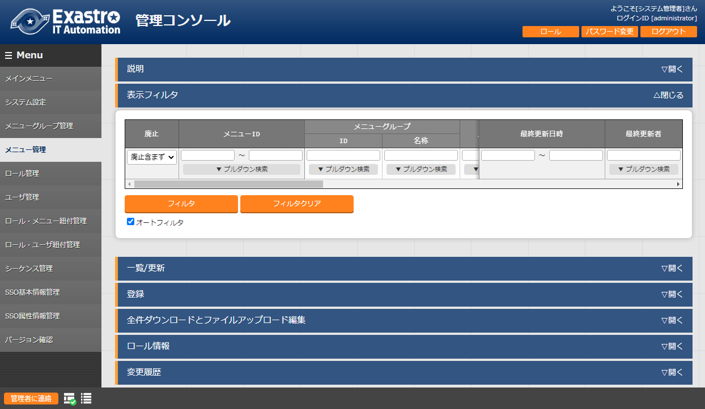
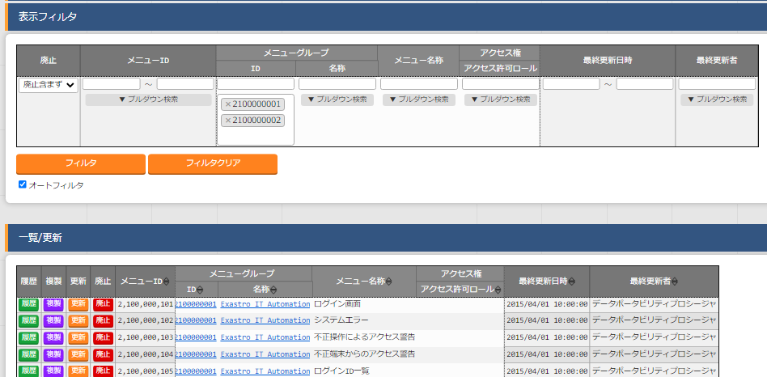
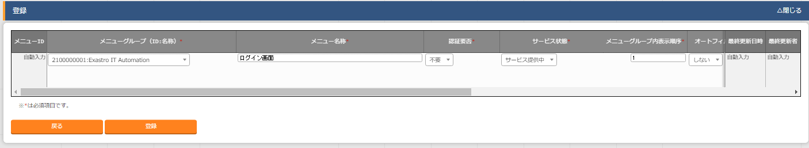
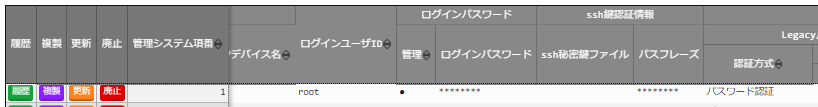
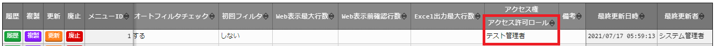
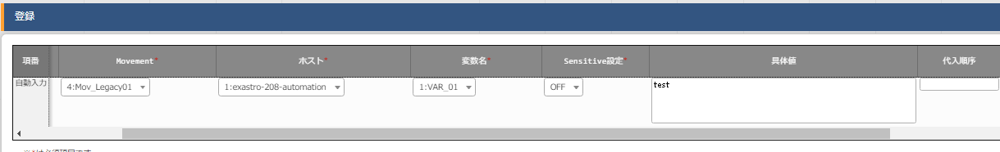
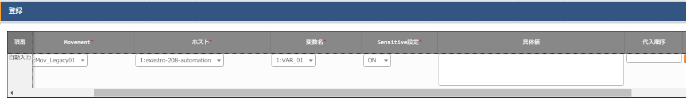
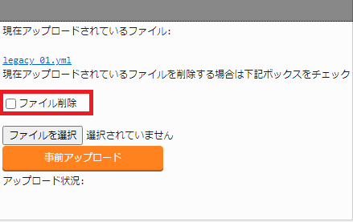
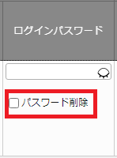

==============
管理コンソール
==============

.. debug:画像差し込み時のpramを確認する

.. figure:: ./management_console/image1.png
   :alt:  Exastroロゴ
   :align: center
   :width: 3.35079in
   :height: 0.78559in

はじめに
========

| 本書は、ITAシステムの管理コンソールの概要および操作方法について記載したものです。

ITAシステム　管理コンソールの概要
=================================

| 本章ではITAを操作するための管理コンソールについて説明します。

ITA管理コンソールについて
-------------------------

| ITA管理コンソールでは、ITAを利用するユーザー（アカウント）、操作メニューの実行権限の登録／更新／削除を行います。
| また、ITA初期メニュー以外に、利用部門が独自の情報をITAのデータベース上で管理する場合、管理レベルにあった個別メニューの作成もできます。
| 個別メニューの登録／変更／削除をご使用される際は、製品サポートへお問い合わせください。

.. table:: Webコンテンツメニュー/画面一覧
   :align: Left

	+----------+------------------------+-----------------------------+
	| **No.**  | **メニューグループ**   |  **メニュー・画面**         |
	|          |                        |                             |
	|          |                        |                             |
	+==========+========================+=============================+
	| 1        | 共通部                 | ログイン画面                |
	+----------+                        +-----------------------------+
	| 2        |                        | パスワード変更画面          |
	+----------+                        +-----------------------------+
	| 3        |                        | ログアウト画面              |
	+----------+------------------------+-----------------------------+
	| 4        | ITA管理コンソール      | メインメニュー              |
	+----------+                        +-----------------------------+
	| 5        |                        | システム設定                |
	+----------+                        +-----------------------------+
	| 6        |                        | メニューグループ管理        |
	+----------+                        +-----------------------------+
	| 7        |                        | メニュー管理                |
	+----------+                        +-----------------------------+
	| 8        |                        | ロール・メニュー紐付管理    |
	+----------+------------------------+-----------------------------+

画面説明 ログイン、パスワード登録
~~~~~~~~~~~~~~~~~~~~~~~~~~~~~~~~~

ログイン画面
************

| ITAシステムのメニュー画面に未ログインでアクセスした場合、「ログイン画面」が表示されます。

.. figure:: ./management_console/image2.png
   :alt:  ITAログイン画
   :align: center
   :width: 4.33071in
   :height: 1.74712in

   ITAログイン画面

.. tip:: | ITAシステムのインストール直後は必ず次のログインＩＤとパスワードでログインしてください。
         | 　ログインID ：administrator
         | 　初期パスワード ：password

| インストール後に初めてログインした際は「パスワード変更画面」に遷移します。

パスワード変更
**************

| ログインユーザーは任意のタイミングで自身のパスワードを変更できます。
| 各メニュー画面右上の「パスワード変更」ボタンから「パスワード変更画面」に遷移し、パスワード変更を行ってください。

   ITAパスワード変更画面

ログアウト画面（もう一度ログインする）
*************************************

| 各メニュー画面右上「ログアウト」ボタンをクリックすると、システムからログアウトします。
| 表示されている「もう一度ログインする」リンクをクリックすると、ログイン画面に遷移します。

   ITAログアウト画面

画面説明 メインメニュー
~~~~~~~~~~~~~~~~~~~~~~~

| メインメニューにはWidgetが表示されます。
| Widgetの内容や配置は個人でカスタマイズすることができます。

画面構成
********

| No.1～5のWidgetがデフォルトで表示されます。No.6～9はデフォルトでは表示されません
| （「Widget追加」ボタンを押下することで追加できます）。

   各種Widget （No.1～9）

.. table:: Widget一覧（No.1～9）
   :align: Left

	+----------+-------------------+-------------------------------------------------------------+------------+
	| **No.**  | **Widget名**      | **説明**                                                    | **デフォ\  |
	|          |                   |                                                             | ルト**     |
	|          |                   |                                                             |            |
	+==========+===================+=============================================================+============+
	| 1        | メニューグループ  | 各メニューグループのパネルが表示されます。\                 | 表示       |
	|          |                   | パネルを押下することで指定の\                               |            |
	|          |                   | メニューグループのメインメニューへ\                         |            |
	|          |                   | 遷移できます。 **インストールしたドライバーのみ**\          |            |
	|          |                   | が表示されます。「メニューグループ」\                       |            |
	|          |                   | Widgetを **削除することはできません** 。                    |            |
	+----------+-------------------+-------------------------------------------------------------+------------+
	| 2        | Movement          | 各オーケストレーションに登録されている\                     | 表示       |
	|          |                   | Movementの件数が円グラフで表示されます。                    |            |
	|          |                   |                                                             |            |
	|          |                   | 「SUM」列の数値またはグラフを押下することで、\              |            |
	|          |                   | 各ドライバーの「Movement一覧」メニューへ\                   |            |
	|          |                   | 遷移できます。                                              |            |
	+----------+-------------------+-------------------------------------------------------------+------------+
	| 3        | 作業状況          | Conductor、Symphonyの作業状況のステータスごとに\            | 表示       |
	|          |                   | 件数が円グラフで表示されます。                              |            |
	|          |                   |                                                             |            |
	|          |                   | 「CON」列の数値を押下することで、\                          |            |
	|          |                   | 「Conductor」メニューグループの「Conductor\                 |            |
	|          |                   | 作業一覧」メニューへ遷移できます。                          |            |
	|          |                   |                                                             |            |
	|          |                   | 「SYM」列の数値を押下することで、\                          |            |
	|          |                   | 「Symphony」メニューグループの「Symphony\                   |            |
	|          |                   | 作業一覧」メニューへ遷移できます。                          |            |
	+----------+-------------------+-------------------------------------------------------------+------------+
	| 4        | 作業結果          | Conductor、Symphonyの作業結果のステータスごとに\            | 表示       |
	|          |                   | 件数が円グラフで表示されます。                              |            |
	|          |                   |                                                             |            |
	|          |                   | 「CON」列の数値を押下することで、\                          |            |
	|          |                   | 「Conductor」メニューグループの「Conductor\                 |            |
	|          |                   | 作業一覧」メニューへ遷移できます。                          |            |
	|          |                   |                                                             |            |
	|          |                   | 「SYM」列の数値を押下することで、\                          |            |
	|          |                   | 「Symphony」メニューグループの「Symphony\                   |            |
	|          |                   | 作業一覧」メニューへ遷移できます。                          |            |
	+----------+-------------------+-------------------------------------------------------------+------------+
	| 5        | 作業履歴          | Conductor、Symphonyの作業履歴の\                            | 表示       |
	|          |                   | 日別の結果が棒グラフで表示されます。                        |            |
	|          |                   |                                                             |            |
	|          |                   | 棒グラフにカーソルを合わせて\                               |            |
	|          |                   | 押下すると件数の詳細が表示されます。                        |            |
	|          |                   |                                                             |            |
	|          |                   | 「CON」列の数値を押下することで、\                          |            |
	|          |                   | 「Conductor」メニューグループの「Conductor\                 |            |
	|          |                   | 作業一覧」メニューへ遷移できます。                          |            |
	|          |                   |                                                             |            |
	|          |                   | 「SYM」列の数値を押下することで、\                          |            |
	|          |                   | 「Symphony」メニューグループの「Symphony\                   |            |
	|          |                   | 作業一覧」メニューへ遷移できます。                          |            |
	+----------+-------------------+-------------------------------------------------------------+------------+
	| 6        | メニューセット    | メインメニューとは別に\                                     | 非表示     |
	|          |                   | メニューグループのセットを作成できます。                    |            |
	+----------+-------------------+-------------------------------------------------------------+------------+
	| 7        | リンク            | リンクのリストを作成できます。                              | 非表示     |
	|          |                   |                                                             |            |
	+----------+-------------------+-------------------------------------------------------------+------------+
	| 8        | 画像              | 画像を貼り付けできます。                                    | 非表示     |
	|          |                   |                                                             |            |
	+----------+-------------------+-------------------------------------------------------------+------------+
	| 9        | 予約作業確認      | ステータスが「未実行（予約）」である\                       | 非表示     |
	|          |                   | Symphony・Conductorの一覧を表示します。                     |            |
	|          |                   |                                                             |            |
	|          |                   | インスタンスID、Symphony及びConductor名、\                  |            |
	|          |                   | オペレーション名、予約日時、予約日時までの\                 |            |
	|          |                   | 残り時間が確認可能です。                                    |            |
	|          |                   |                                                             |            |
	|          |                   | インスタンスIDを押下すると、\                               |            |
	|          |                   | 対象の作業確認画面へと遷移します。                          |            |
	+----------+-------------------+-------------------------------------------------------------+------------+

画面説明 基本画面構成
~~~~~~~~~~~~~~~~~~~~~

| ITAシステムが提供する各メニュー画面は基本的に同じ要素で構成されています。
| その構成要素は次のとおりです。

   画面構成

.. table:: 画面構成一覧
   :align: Left

   +---------+------------+------------------------------------------------------+
   | **No.** | **画面名** | **説明**                                             |
   |         |            |                                                      |
   +=========+============+======================================================+
   | 1       | メニュー\  | 各メニューが所属しているグループの名称。\            |
   |         | グループ   | 現在表示しているメニューグループ名が表示されます。   |
   +---------+------------+------------------------------------------------------+
   | 2       | メニュー   | 現在のメニューグループで、\                          |
   |         |            | 操作/表示可能なメニューがリストとして表示されます。  |
   +---------+------------+------------------------------------------------------+
   | 3       | サブ\      | 各メニューに対応する登録、設定などを行う部分です。\  |
   |         | メニュー   | ※詳細は後述します。                                  |
   +---------+------------+------------------------------------------------------+
   | 4       | ログイン\  | 現在ログインしているアカウント名が表示されます。     |
   |         | 情報       | 所属しているロールの確認やパスワード変更、\          |
   |         |            | ログアウト処理操作が可能です。                       |
   +---------+------------+------------------------------------------------------+
   | 5       | システム\  | 管理者のメールアドレスのリンクです。                 |
   |         | 管理者     |                                                      |
   +---------+------------+------------------------------------------------------+

| 各メニュー操作部の構成要素に対する操作方法を説明します。

表示フィルタ
************

| 各メニューで登録されている項目を表示するための検索条件を指定します。
| 検索条件、検索項目はメニューごとに異なります。ここでは共通機能について説明します。

   表示フィルタ画面-1

   表示フィルタ画面-2

A.　廃止カラム
  | 初期状態では、「廃止含まず」がセットされています。
  | 他に「全レコード」、「廃止のみ」が任意操作で選択可能であり、希望表示方法を指定します。
  | **必ずいずれかの選択が必須**\ 。

B.　検索条件
  | 検索する条件を指定します。
  | システム名や備考などにおいて、文字指定ができる項目については「あいまい検索」
  | or「プルダウン検索」でフィルタすることができます。

C.　 アクセス権
  | アクセス権の詳細については、「ITA利用手順マニュアル　ロールベースアクセス制御」を参照して下さい。

D.　 オートフィルタ
  | オートフィルタをチェックしておくと、フィルタ条件を選択するごとに条件に合った一覧を自動で表示します。
  | 画面表示時のチェック有無は、管理コンソール「メニュー管理」の「オートフィルタチェック」で設定可能です。

E.　 カラム説明 (Description)
  | カーソルを合わせると該当する列の説明文がポップアップ表示されます。

F.　 テーブル設定
  | テーブルの項目の表示/非表示切り替えと、テーブルをスクロールした際の固定箇所の設定が行えます。
  | テーブルの設定はフィルタ表示、一覧/更新、変更履歴の項目で行えます。
  | 機能の詳細は「 :ref:`table_config` 」で説明します。

.. debug:ページ内リンクの処理について確認する：「\ *(8)テーブル設定*\ 」

一覧/更新
*********

| 表示フィルタで指定した検索条件に一致した項目の一覧が表示されます。

   「一覧／更新」サブメニュー

   「一覧/更新」サブメニュー 更新フォーム

A.　フィルタ　
  | 検索条件を手入力およびプルダウンメニューから選択し、Enterキーまたは「フィルタ」ボタンを押下すると「一覧／更新」サブメニューに登録情報が表示されます。

B.　履歴
  | 各項目に対して「履歴」ボタンを押下すると変更履歴画面に遷移します。

C.　 複製
  | 各項目に対して「複製」ボタンを押下すると、対象項目の値を反映した状態の登録画面に遷移します。

D.　 更新
  | 各項目に対して「更新」ボタンを押下すると更新画面に遷移します。
  | 情報を更新し、「更新」ボタンを押下することで更新が完了します。

E.　 廃止
  | 「廃止」ボタンを押下すると廃止画面に遷移します。
  | 「廃止」ボタンを押下すると登録情報が無効になります。
  | 無効となった情報は、復活させることができます。
  | 表示フィルタの「廃止のみ」を選択して表示し、「復活」ボタンを押下することで、
  | 情報が有効になります。

F.　 アクセス権
  | アクセス権の詳細については、「ITA利用手順マニュアル_データレコード毎のロールベースアクセス制御」を参照して下さい。

複製
****

| 複製ボタンを押下後、対象項目の値を反映した状態の登録画面に遷移します。

   登録画面（複製時）-1

   登録画面（複製時）-2

| 尚、対象項目がパスワード項目またはアクセス許可ロールの場合、複製処理は行われません。

   登録画面（複製時-パスワード項目）-1

   登録画面（複製時-パスワード項目）-2

   登録画面（複製時-アクセス許可ロール項目）-1

   登録画面（複製時-アクセス許可ロール項目）-2

| Ansible-Legacyメニューグループ＞代入値管理メニューのように、Sensitive設定が存在する項目に関しては、Sensitive設定が「OFF」の場合のみ複製処理を行います。

Sensitive設定が「OFF」の場合

   Sensitive設定が「ON」の場合-1

   Sensitive設定が「ON」の場合-2

   登録画面（複製時- Sensitive設定）-1

   登録画面（複製時- Sensitive設定）-2

登録
****

| 各メニューに対して、新規に項目を登録します。
| 登録内容は各メニューによって異なりますので、各利用手順マニュアルを参照してください。

A.　登録
  | 「登録」サブメニューを開き、「登録開始」ボタンを押下して登録フォームを表示します。
  | 必要な情報を入力し、「登録」ボタンを押下します。

B.　アクセス権
  | アクセス権の詳細については、「ITA利用手順マニュアル_データレコード毎のロールベースアクセス制御」を参照して下さい。

登録全件ダウンロードとファイルアップロード編集
**********************************************

| 各メニュー画面に登録されている情報を一括してエクセル形式でダウンロードすることができます。
| また、同じ形式のファイルで、一括して情報を登録することができます。

|image3| |image4|

図 1.1- 30 登録（一括）画面

A.　全件ダウンロード、新規登録用ダウンロード
  | 「全ダウンロード(Excel)」ボタンを押下すると、各メニュー画面で登録している項目の一覧をエクセル形式でダウンロードできます。
  | 「新規登録用ダウンロード(Excel)」ボタンを押下すると、各メニュー画面に対応する新規登録用のエクセルシートをダウンロードできます。

B.　ファイルアップロード
  | Ａの全件ダウンロード、新規登録用ダウンロードでダウンロードしたエクセルファイルを編集し、ここからアップロードすることで一括して追加、登録ができます。
  | 「参照」ボタンでファイルを指定し、「ファイルアップロード」ボタンを押下してください。

C.　 変更履歴全件ダウンロード
  | 「変更履歴全件ダウンロード(Excel)」ボタンを押下すると、各メニュー画面で登録している項目一覧の変更履歴全件をエクセル形式でダウンロードできます。

変更履歴
********

| 各メニューで、登録した項目の変更履歴を表示することができます。

|image5| |image6|

図 1.1- 31 変更履歴画面

A.　各メニューの主キーを指定することで、対応する項目の変更履歴を表示することができます。

B.　変更実施日時が新しい順に一覧表示され、前回との変更箇所が青色太文字で表示されます。

プルダウン選択を含んだ場合の変更履歴について
  | 「プルダウン選択」の参照元を変更した場合、参照側の値も自動的に変更されます。「変更履歴」は、値を編集（登録/更新/廃止/復活）した時点の値が表示されます。
  | 以下、例を用いて説明します。

  | 例：
  | パラメータシート「ぱらむ001」の項目「ぱらむB」が「マスタ001」の項目「マスタ」を参照している場合

  | ※事前準備として、以下のデータシートおよびパラメータシートを作成します。

  | データシート「マスタ001」

  .. figure:: ./management_console/image43.png
     :alt: 「メニュー定義・作成」メニューで作成したデータシート
     :align: center
     :width: 5.51181in
     :height: 1.81191in

     「メニュー定義・作成」メニューで作成したデータシート

  | パラメータシート「ぱらむ001」

  .. figure:: ./management_console/image44.png
     :alt: 「メニュー定義・作成」メニューで作成したパラメータシート
     :align: center
     :width: 5.51181in
     :height: 2.10418in

     「メニュー定義・作成」メニューで作成したパラメータシート

  | 操作：

  #. 「マスタ001」に値「mas1-1」を登録します。
      .. figure:: ./management_console/image45.png
        :alt:  データシート「マスタ001」
        :align: center
        :width: 5.31496in
        :height: 1.54314in

         データシート「マスタ001」

  #. 「ぱらむ001」に 1 件登録します。
      .. figure:: ./management_console/image46.png
         :alt:  パラメータシート「ぱらむ001」
         :align: center
         :width: 5.31496in
         :height: 1.16315in

         パラメータシート「ぱらむ001」

  #. 「ぱらむ001」を更新します ※「更新」ボタンの押下のみ
      .. figure:: ./management_console/image47.png
         :alt:  パラメータシート「ぱらむ001」
         :align: center
         :width: 5.31496in
         :height: 1.62421in

         パラメータシート「ぱらむ001」

  #. 「マスタ001」の値を「mas1-2」に更新します。
      .. figure:: ./management_console/image48.png
         :alt:  データシート「マスタ001」
         :align: center
         :width: 5.31496in
         :height: 1.5448in

         データシート「マスタ001」

  #. 「マスタ001」の値を「mas1-3」に更新します。
      ..

         （図省略）

  #. 「ぱらむ001」を更新します。 ※「更新」ボタンの押下のみ
      ..

         （図省略）

  #. 「マスタ001」の値を「mas1-4」に更新
      ..

         （図省略）

  #. 「マスタ001」の値を「mas1-5」に更新
      ..

         （図省略）

  #. 「ぱらむ001」を更新 ※「更新」ボタンの押下のみ
       ..

          （図省略）

  | 結果：

  .. figure:: ./management_console/image49.png
     :alt:  データシート「マスタ001」の変更履歴
     :align: center
     :width: 5.31496in
     :height: 2.25657in

     データシート「マスタ001」の変更履歴

  .. figure:: ./management_console/image50.png
     :alt:  パラメータシート「ぱらむ001」の変更履歴
     :align: center
     :width: 5.32046in
     :height: 3.38029in

     パラメータシート「ぱらむ001」の変更履歴

プルダウンによる入力項目について
********************************

| 登録/更新時の入力項目で、プルダウンによる選択が可能な項目は、以下の仕様となっています。

   プルダウンによる入力項目

A.　検索窓が表示されます。検索したい語句を入力することにより、選択項目を絞り込むことができます。部分一致検索で、大文字と小文字、全角と半角は補正検索されます。

B.　選択項目が表示されます。

.. debug:ページ内リンク先
.. _table_config:
テーブル設定
************

-  テーブルの項目の表示/非表示切り替えと、テーブルをスクロールした際の固定箇所の設定が行えます。
-  テーブルの設定は「フィルタ表示」、「一覧/更新」、「変更履歴」の項目で行えます。
-  テーブル設定はWebブラウザのローカルストレージに保存されるため、設定はWebブラウザごとになります。

   テーブル設定メニュー表示（一覧/更新）-1

   テーブル設定メニュー表示（一覧/更新）-2

A.　Paging
  -  選択すると一覧下部にページ送り機能が表示されます。
  -  数値を書き換えることで1ページ内の最大表示数を変更することが可能です。

B.　Heading Fixed
  -  テーブルをスクロールした際の固定箇所を設定します。
  -  デフォルトでは全ての設定で固定になっています。
  .. note:: | 各固定箇所の説明は以下の通りです。
              - Top Heading Fixed　：　テーブル上部の項目名
              - Left Heading Fixed　：　テーブル左部の更新、廃止、一意項目
                 |  例） 「メニュー管理」メニューの場合はメニューID
              - Right Heading Fixe ： テーブル右部の最終更新日時、最終更新者

C.　Show or Hide
  -  選択した項目の表示/非表示を設定します。
  -  デフォルトでは全ての項目が表示されます。

D.　ボタン
  -  Applyボタンを押下すると選択/非選択した項目が設定に反映されます。
  -  Closeを押下するとテーブル設定メニューが閉じます。
  -  Resetを押下すると選択/非選択した項目が全てデフォルトの状態に戻ります。

E.　非表示項目数の表示
  -  Show or Hideで非表示にした項目数が表示されます。
  -  全項目を表示している場合は、数字は表示されません。

ヘッダー固定設定
****************

| フッター内の左側のアイコンを押下するとヘッダーを固定化・固定解除することができます。

   ヘッダー固定化アイコン

サブメニュー初期状態設定
************************

| フッター内の右側のアイコンを押下するとサブメニューの開閉の初期状態を設定することができます。

|image7|

図 1.1- 43　サブメニュー初期状態設定アイコン

| 選択したサブメニューが、メニューにアクセスした際にあらかじめ開いた状態に設定されます。
| （※デフォルトで開く設定のものは初期設定でチェックが付いています。）

|image8|

図 1.1- 44　 サブメニュー初期状態設定画面

画面説明 メニューの操作方法
~~~~~~~~~~~~~~~~~~~~~~~~~~~

システム設定
************

| ITAシステム導入・運用時に設定すべき各種情報の登録／更新／廃止を行います。

.. figure:: ./management_console/image57.png
   :alt:  システム設定画面
   :align: center
   :width: 6.22721in
   :height: 2.75357in

   システム設定画面

【システム設定変更方法】
  | 「一覧/更新」の変更したい項目の「更新」ボタンをクリックします。
  | 「設定値」に変更したい値を入力し、更新をクリックします。

  .. danger:: | 「識別ID」は変更しないでください。ITAの動作が保証されません。

   システム設定

アップロード禁止拡張子
  | ファイルアップロードを禁止する拡張子を設定することが出来ます。

  .. danger::  | 拡張子は半角セミコロン区切りで入力してください。
               | アップロード禁止拡張子の許可を増やすと、セキュリティホールになる可能性があります。

.. debug:表示要確認

メニューグループ管理
********************

| メニュー（子）はメニューグループ（親）に属します。この画面で親となるメニューグループの登録／更新／廃止を行います。
| メニューグループ名称は、\ **一意**\ である必要があります。

.. debug:①
メニューグループに対するメニューの確認
  | 「一覧/更新」サブメニューから、その機能に対するメニュー情報の対応を確認できます。

   メニューグループ管理画面

.. debug:②
メニュー管理への遷移
  | メニューIDまたはメニュー名称のリンクをクリックすると、対象のメニュー管理へ遷移します。

   メニュー情報画面（メニュー管理）

| ここで、各サブメニューの操作について説明します。操作は、他のメニューにおいても共通です。

.. tip:: | データ更新系の操作のため、システム管理者でログインしてください。

【登録内容の更新／廃止 － 1件ごと更新／廃止／復活】
  | メニューグループを1件1件更新／廃止／復活する場合の操作です。

.. debug:③
「一覧/更新」サブメニューに登録情報を表示
  | 「表示フィルタ」に検索条件を入力し、Enterキーか「フィルタ」ボタンをクリックします。
  #.  登録内容を変更する 　　　　　　－ 「更新」 ボタンで編集モードにし、値を変更します。
  #.  項目を無効にする 　　　　　　　－ 「廃止」 ボタンをクリックします。
  #.  無効（廃止）の項目を有効にする － 「復活」 ボタンをクリックします。

.. debug:④
| 確認のポップアップ画面が表示され、「OK」または「キャンセル」をクリックします。

【追加登録 – 1件ずつ登録】
  | メニューグループを1件1件登録する場合の操作です。

  | 「登録」 サブメニューを開き、「登録開始」 ボタンをクリックして登録フォームを表示します。
  | 「メニューグループ名称」を入力し、「登録」 ボタンをクリックします。

  .. warning:: - メニューグループ名称は重複登録できません。
               - 「表示順序」は任意ですが、空白の場合はメニューグループがメインメニューに表示されません。
               - 「表示順序」の昇順にメインメニューに表示されます。「表示順序」が同じ場合は、「メニューグループID」の昇順で表示されます。

  .. note:: | 「備考」は任意です。

   メニューグループ管理画面（登録）

【登録内容の更新／廃止– まとめて更新／廃止】
  | 一度に複数のメニューグループを登録する場合の操作です。

  #. 「全件ダウンロードとファイルアップロード編集」サブメニューを開き、「全件ダウンロード(Excel)」で新規登録用シートをダウンロードします。
  #. 以下の各項目を入力してファイルを保存します。

     実行処理種別= 登録／更新／廃止／復活 を選択します。

     -  メニューグループ名称 = 変更後の名称です。
     -  表示順序 　　　　　　= 変更後の内容です。
     -  備考 　　　　　　　　= 変更後の内容です。

  #. 「ファイルを選択」 ボタンで②のファイルを指定し、「ファイルアップロード」 でアップロードを行います。

  .. warning:: | 「実行処理種別」が未選択および正しい処理種別を選択していない場合、登録が実行されません。

【追加登録 – まとめて登録】
  | 一度に複数のメニューグループを登録する場合の操作です。

  #. 「全件ダウンロードとファイルアップロード編集」サブメニューを開き、「新規登録用ダウンロード(Excel)」で新規登録用シートをダウンロードします。
  #. 以下の各項目を入力してファイルを保存します。
     -  実行処理種別 = 登録
     -  メニューグループ名称 = 新規に登録するメニューグループ名称
     -  表示順序 = メニューグループの表示順序

     .. figure:: ./management_console/image62.png
        :alt:  メニューグループ管理画面
        :align: center
        :width: 4.72984in
        :height: 3.41106in

        メニューグループ管理画面

  #. 「ファイルを選択」 ボタンで②のファイルを指定し、「ファイルアップロード」でアップロードを行います。

.. debug:レスポンシブルなページなので改行をどうするか…
.. warning:: -  | 「実行処理種別」を「登録」\ **以外**\ にすると、\ **登録が実行されません**\ 。
             -  | メニューグループの登録を行うと、
                | 作成したメニューグループ配下に自動的に「メインメニュー」 が登録されて、「システム管理者」ロールのユーザで参照することが可能となります。

                | 具体的には、以下のメニューに自動的にデータが登録されます。
                + 「メニュー管理」メニュー
                + 「ロール・メニュー紐付管理」メニュー

【パネル用画像】
  | 「登録」 サブメニューにて「パネル用画像」を設定することができます。

  .. warning:: | 「パネル用画像」に使用できるのは\ **PNGファイルのみ**\ です。
               | IPFファイル\ :sup:`\*`\  [1]_を使用することはできません。

  .. figure:: ./management_console/image61.png
     :alt:  パネル用画像画面
     :align: center
     :width: 5.90551in
     :height: 1.88499in

     パネル用画像画面

  | 「パネル画像エディタ」サブメニューでパネル用画像を作成することができます。

  .. figure:: ./management_console/image63.png
     :alt:  パネル画像エディタ画面
     :align: center
     :width: 5.90551in
     :height: 4.03342in

     パネル画像エディタ画面

  .. warning:: | 「パネル画像エディタ」サブメニューはIEには対応しておりません。

  #. 「Save IPF」ボタン
      | 編集したパネル画像のデータをIPF形式の圧縮ファイルで保存することができます。

  #. 「Read IPF」ボタン
      | IPFファイルをキャンバスに読み込むことができます。
      .. note:: | 「Save IPF」ボタンで保存した状態から編集を継続することができます。

  #. 「Output PNG」ボタン
      | キャンバス上で編集したパネル画像をアートボードの領域でPNG画像として保存します。
      .. note::  | 編集の継続はできません。

  #. 「View Reset」ボタン
      | キャンバスの位置を初期値に戻します。

  #. 「Full Screen」ボタン
      | エディタをフルスクリーンで表示することができます。

  #. キャンバス
      | 右クリックでドラッグアンドドロップし位置を移動することができます。

  #. アートボード
      | PNG画像として書き出される範囲です。

  #. パネル画像の詳細設定機能
      -  「Layer」タブ

         #. 各種レイヤーを追加することができます。

            + 「Text」ボタン　　　： 一行テキスト
            + 「Symbol」ボタン　　： アイコン
            + 「Shape」ボタン 　　： 基本図形
            + 「Image」ボタン 　　： 画像

         #. 編集対象を選択し、アイコンの左側から下記の操作が可能です。

            + 順番入れ替え　　　　： ドラッグアンドドロップでレイヤーを入れ替えることができます。
            + 表示非表示　　　　　： アイコンのクリックで切り替えることができます。
            + コピー　　　　　　　： 選択したレイヤーをコピーし複製することができます。
            + 削除　　　　　　　　： 選択したレイヤーを削除することができます。

         #. 追加された各種レイヤーに以下の設定が可能です。

            | ※レイヤーごとに編集できる項目が変わります。

            + 「Common」タブ　　　： 共通・メイン項目です。色やサイズの変更が可能です。
            + 「IME」タブ 　　　　： （レイヤーの種類が「Text」の場合）入力補助機能を使用することができます。
            + 「Symbol」タブ　　　： （レイヤーの種類が「Symbol」の場合）シンボルを切り替えることが可能です。
            + 「Shape」タブ 　　　： （レイヤーの種類が「Shape」の場合）図形を切り替えることが可能です。
            + 「Border」タブ　　　： 線の詳細設定が可能です。
            + 「Transform」タブ 　： 大きさや角度などの詳細設定が可能です。
            + 「Filter」タブ　　　： 各種効果の詳細設定が可能です。
               .. warning:: | Edgeは未対応のため非表示になります。

      - 「Document」タブ
         | 作成したパネル画像に任意の名称を設定できます。

.. _menu_list:
メニュー管理
************

| この画面でコンテンツの機能（メニュー）の登録／更新／廃止を行います。
| メニュー名称は\ **一意**\ である必要があります。

#. メニューグループ管理への遷移

   | メニューグループIDまたはメニューグループ名称のリンクをクリックすると、対象のメニューグループ管理へ遷移します。

#. メニューに対するロール情報の確認

   | 「一覧/更新」サブメニューから、その機能に対するロール情報の対応を確認できます。

   .. figure:: ./management_console/image64.png
      :alt:  メニュー管理
      :align: center
      :width: 5.99385in
      :height: 3.15361in

      メニュー管理

#. ロール管理への遷移

   | ロールIDまたはロール名称のリンクをクリックすると、対象のロール管理へ遷移します。

   .. figure:: ./management_console/image65.png
      :alt:  ロール情報画面（メニュー管理）
      :align: center
      :width: 5.15748in
      :height: 1.43314in

      ロール情報画面（メニュー管理）

#. パラメータ

   | メニューの登録情報には次の項目があります。

   .. figure:: ./management_console/image66.png
      :alt:  メニュー登録画面（メニュー管理）
      :align: center
      :width: 5.90551in
      :height: 1.02935in

      メニュー登録画面（メニュー管理）

   .. table:: 「メニュー管理」のパラメータ
      :align: Left

      +---------+--------------------+---------------------------------------------------------------------------+
      | **No.** | **項目名**         | **説明**                                                                  |
      |         |                    |                                                                           |
      +=========+====================+===========================================================================+
      | 1       | 認証要否           | 不要          ：ログインせずにアクセス可能です。                          |
      |         |                    |                                                                           |
      +         +                    +---------------------------------------------------------------------------+
      |         |                    | 要            ：ログイン後のみアクセス可能です。                          |
      |         |                    |                                                                           |
      +---------+--------------------+---------------------------------------------------------------------------+
      | 2       | サービス状態       | サービス提供中：アクティブ状態です。一般ユーザーがアクセス可能です。      |
      |         |                    |                                                                           |
      +         +                    +---------------------------------------------------------------------------+
      |         |                    | メニュー開発中：システム管理者のみがアクセス可能です。                    |
      |         |                    |                                                                           |
      +---------+--------------------+---------------------------------------------------------------------------+
      | 3       | メニュー\          | メニューグループのサブメニューで表示する順序です。\                       |
      |         | グループ内表示順序 | 昇順で上から表示されます。                                                |
      |         |                    |                                                                           |
      +---------+--------------------+---------------------------------------------------------------------------+
      | 4       | オートフィルタ\    | メニュー表示時に「オートフィルタ」の\                                     |
      |         | チェック           | チェックボックスにチェックを入れるかどうかの設定です。                    |
      |         |                    |                                                                           |
      +---------+--------------------+---------------------------------------------------------------------------+
      | 5       | 初回フィルタ       | メニュー表示時に「フィルタ」を押下した状態で表示するかどうかの設定です。  |
      |         |                    |                                                                           |
      +---------+--------------------+---------------------------------------------------------------------------+
      | 6       | Web表示最大行数    | 「一覧/更新」に表示する最大行数です。                                     |
      |         |                    |                                                                           |
      +---------+--------------------+---------------------------------------------------------------------------+
      | 7       | Web表示前確認行数  | 「一覧/更新」に出力する前に確認ダイアログを表示する最大行数です。         |
      |         |                    |                                                                           |
      +---------+--------------------+---------------------------------------------------------------------------+
      | 8       | Excel出力最大行数  | Excel出力する最大行数（0～1048576まで設定可能）です。                     |
      |         |                    |                                                                           |
      +---------+--------------------+---------------------------------------------------------------------------+

   | 「Web表示最大行数」と「Web表示前確認行数」には次のような関係があります。

    図 1.1- 56　Web表示最大行数の処理概要

   | 「各メニュー項目一覧」又は「各メニュー項目一覧の全履歴数」が「Excel出力最大行数」を超えている場合、
   | そのメニューの「全件ダウンロードとファイルアップロード編集」の項目の表示が、以下のように変化します。

   .. figure:: ./management_console/image67.png
      :alt:  エラー表示画面（メニュー管理）
      :align: center
      :width: 5.70844in
      :height: 3.16017in

      エラー表示画面（メニュー管理）

   | この画面からダウンロードできるファイルは、Excelではなく独自フォーマットのCSVです。
   | このファイルを使って編集、アップロードを行いたい場合は、「独自フォーマット編集Excel作成ツール」のボタンでツールをダウンロードし、
   | ダウンロードされたファイルの中にある「ReadMe」ファイルの説明に従って操作してください。

   | 画面下部の変更履歴全件ダウンロードは出力し確認する用途で、アップロードには対応しておりません。

ロール・メニュー紐付管理
************************

| 各メニューとロール対応付けの登録／更新／廃止を行います。
| ロールに紐付かないメニュー画面はメニューグループに表示されません。

#. ロール管理への遷移

   | ロールIDまたはロール  名称のリンクをクリックすると、対象のロール管理へ遷移します。

#. メニューグループ管理への遷移

   | メニューグループIDまたはメニューグループ名称のリンクをクリックすると、対象のメニューグループ管理へ遷移します。

#. メニュー管理への遷移

   | メニューIDまたはメニュー名称のリンクをクリックすると、対象のメニュー管理へ遷移します。

   .. figure:: ./management_console/image73.png
      :alt:  ロール・メニュー紐付管理画面
      :align: center
      :width: 6.1672in
      :height: 3.32029in

      ロール・メニュー紐付管理画面

   | 「:ref:`menu_list`」で登録したロールとメニューがリストボックスに表示されます。

   | （下図 ①,②）ので、それぞれを選択し、紐付タイプ（下図 ③）を選択します。

   .. figure:: ./management_console/image74.png
      :alt:  グループメニュー権限の設定画面（ロール・メニュー紐付管理）
      :align: center
      :width: 5.90551in
      :height: 1.57387in

      グループメニュー権限の設定画面（ロール・メニュー紐付管理）

ファイル削除管理
****************

| サーバ上のファイルの最終更新日を確認して、保存期間が過ぎているファイルを削除する設定を行います。
| 当機能は、導入初期は無効のため、\ **メニューに表示されていません**\ 。
| 利用する場合は、以下の手順で有効にしてください。

#. 「ロール・メニュー紐付管理」を開く
#. 「表示フィルタ」→「メニューグループ」のプルダウンから「管理コンソール」を選択する
#. 「ファイル削除管理」を「復活」する
#. 画面をリロードする

   .. figure:: ./management_console/image83.png
      :alt:  ファイル削除管理画面
      :align: center
      :width: 5.90718in
      :height: 3.68699in

      ファイル削除管理画面

| 画面の項目一覧は以下のとおりです。

.. table:: 登録画面項目一覧（投入オペレーション一覧）
   :align: left

   +------------+-------------------------------------------+----------+----------+----------------+
   | **項目**   | **説明**                                  | **入力\  | **入力\  | **制約事項**   |
   |            |                                           | 必須**   | 形式**   |                |
   |            |                                           |          |          |                |
   +============+===========================================+==========+==========+================+
   | 削除日数   | 最終更新日を基準にして、\                 | ○        | 手動     | 数値           |
   |            | 設定した日数を経過していたら、\           |          | 入力     |                |
   |            | 削除を行います。                          |          |          |                |
   +------------+-------------------------------------------+----------+----------+----------------+
   | 削除\      | 削除対象ファイルが\                       | ○        | 手動     | 最大長         |
   | 対象ディ\  | 格納されているディレクトリを設定します。  |          | 入力     | 1024バイト     |
   | レクトリ   |                                           |          |          |                |
   +------------+-------------------------------------------+----------+----------+----------------+
   | 削除対象\  | 削除対象のファイル名を\                   | ○        | 手動     | 最大長         |
   | ファイル   | 指定します。                              |          | 入力     | 1024バイト     |
   |            |                                           |          |          |                |
   |            | ワイルドカードでの設定が可能です。        |          |          |                |
   |            |                                           |          |          |                |
   +------------+-------------------------------------------+----------+----------+----------------+
   | サブディ\  | 削除対象ディレクトリ直下の\               | ○        | リスト\  | あり／なし     |
   | レクトリ\  | ディレクトリも削除するかどうか設定する。  |          | 選択     |                |
   | 削除有無   |                                           |          |          |                |
   |            | 「あり」の場合、削除対象ディレクトリ\     |          |          |                |
   |            | 直下のディレクトリの名前と最終更新日を\   |          |          |                |
   |            | 確認して削除対象であれば削除します。      |          |          |                |
   |            |                                           |          |          |                |
   +------------+-------------------------------------------+----------+----------+----------------+

ファイル項目-ファイル削除機能
*****************************

| 必須でないファイル項目において、「ファイル削除」チェックボックスにチェックを入れた状態で更新を実行すると、登録済みのファイルが削除されます。（必須項目の場合はチェックボックスが非表示となります。）

|image12|　　　　　　　|image13|

図 1.1- 74　 ファイル項目-ファイル削除チェックボックス

ファイル項目-ファイルダウンロード機能
*************************************

| ファイル名のリンクを押下することでダウンロードが可能です。
| ※ただし、鍵ファイルの場合はダウンロード不可となります。

|image14|　　　　　|image15|

図 1.1- 75　ファイル項目-ファイルダウンロード

パスワード項目-パスワード削除機能
*********************************

| 必須でないパスワード項目において、「パスワード削除」チェックボックスにチェックを入れた状態で更新を実行すると、対象項目の値が削除されます。（必須項目の場合はチェックボックスが非表示となります。）

|image16|　　　　　　　|image17|

図 1.1- 76　ファイル項目-ファイルダウンロード

BackYardコンテンツ
------------------

| ここでは、ITA基本機能でのBackYardコンテンツについて説明します。
| BackYardはサーバー内で独立して動作する常駐プロセス化した機能です。Webブラウザ上で操作する
| Webコンテンツとは異なり、ユーザーはBackYardの存在を意識することはありません。
| 処理の開始・停止等の制御はコマンドラインで実行してください。

BackYard処理一覧
~~~~~~~~~~~~~~~~

| BackYardの処理の一覧を以下に記述します。

.. debug:ActiveDirectoryについての記述は削除？

.. table:: BackYard機能
   :align: left

   +---------+---------------------+-------------------------------+-----------------+
   | **No.** | **処理名称**        | **ファイル名**                | **備考**        |
   |         |                     |                               |                 |
   +=========+=====================+===============================+=================+
   | 1       | メール送信          | ky_mail\ :sup:`※1`            | 必要が無ければ\ |
   |         |                     |                               | 停止可          |
   +---------+---------------------+-------------------------------+-----------------+
   | 2       | ロール紐付\         | ky_std_checkc\                | 常駐            |
   |         | 確認＋クリーニング  | ondition-linklist\ :sup:`※1`  |                 |
   +---------+---------------------+-------------------------------+-----------------+
   | 3       | 投入オペレーション\ | ky_execinstance_dataauto\     | Cron起動        |
   |         | 確認＋クリーニング  | clean-workflow.sh\ :sup:`※2`  |                 |
   +---------+---------------------+-------------------------------+-----------------+
   | 4       | ファイル\           | ky_file_auto\                 | Cron起動        |
   |         | 確認＋クリーニング  | clean-workflow.sh\ :sup:`※3`  |                 |
   +---------+---------------------+-------------------------------+-----------------+
   | 5       | ActiveDirect\       | ky_acti\                      | 常駐            |
   |         | ory情報ミラーリング | vedirectory_roleuser_replica\ |                 |
   |         |                     | tion-workflow.php\ :sup:`※4`  |                 |
   |         |                     |                               |                 |
   +---------+---------------------+-------------------------------+-----------------+

.. debug:注釈の表現を考え中
..

   ※1 ファイル配置ディレクトリは ~/ita-root/backyards/webdbcore

   ※2、4 ファイル配置ディレクトリは ~/ita-root/backyards/ita-base

   ※3 ファイル配置ディレクトリは ~/ita-root/backyards/common

BackYard処理説明
~~~~~~~~~~~~~~~~

| BackYardの処理について説明を以下より記述します。

メール送信
**********

| メール送信は、ユーザーが作成したメールのテンプレートに送信元、送信先アドレスや本文内の変数を動的に置換し、自動送信する処理です。

| メール送信はテンプレートリスト、テンプレート、送信依頼ファイルという3つのファイル（詳細後述）を参照し、実行の要否を判断しながら処理を行います。
| 送信パターンはフリー型、セーフ型、フリーフォーマット型の3パターンがあります。
| それぞれのパターンによる各ファイルの要不要、必要事項は次の表のとおりです。

.. table:: 送信タイプ別参照ファイルへの記載事項
   :align: left

   +-------------+--------------+-----------+-----------+--------+-------+----------+---------+-------+-----------+
   | **ファ\     | **テンプ\    | **テンプレートリスト**                 | **送信依頼ファイル**                   |
   | イル名**    | レート**     |                                        |                                        |
   |             |              |                                        |                                        |
   +=============+==============+===========+===========+========+=======+==========+=========+=======+===========+
   |             | ファイル中\  | テンプ\   | 置き換え  | from,  | cc    | タイトル | from,   | cc    | 置き換え  |
   |             | の項目       | レートID  |           | to     |       |          | to      |       |           |
   |             |              |           | 文言数    |        |       |          |         |       | 文字列    |
   |             |              |           |           |        |       |          |         |       |           |
   +-------------+--------------+-----------+-----------+--------+-------+----------+---------+-------+-----------+
   | 送信タイプ  | 位置         | 1列目     | 2列目     | 3列目  | 4列目 | 1行目    | 2,3行目 | 4行目 | 5行目\    |
   |             |              |           |           |        |       |          |         |       | 以降      |
   |             |              |           |           |        |       |          |         |       |           |
   +-------------+--------------+-----------+-----------+--------+-------+----------+---------+-------+-----------+
   | フリー型    | 必要         | 必須      | 数値      | 不要           | 必須     | 必須    | 任意  | 指定分の\ |
   |             |              |           |           |                |          |         |       | 文字列    |
   +-------------+              +           + （0以上） +--------+-------+          +---------+-------+           +
   | セーフ型    |              |           |           | 必須   | 任意  |          | 不要            |           |
   +-------------+--------------+           +-----------+        +       +          +                 +-----------+
   | フリー\     | 不要（※）    |           | X 固定    |        |       |          |                 | 不要      |
   | フォー\     |              |           |           |        |       |          |                 |           |
   | マット型    |              |           |           |        |       |          |                 |           |
   +-------------+--------------+-----------+-----------+--------+-------+----------+---------+-------+-----------+

.. tip:: | メール本文は送信依頼ファイルに記述します。

| 次に、各ファイルの説明とサンプルを提示します。

.. danger:: | 各ファイルは、\ **文字コード[UTF-8]／改行(LF)**\ で編集してください。

.. _template_list:
#. テンプレートリスト

   - ファイル名 ： sysmail.list
   - 配置ディレクトリ ： ~/ita-root/confs/backyardconfs/

   | メールテンプレートで使用する変数数や送信先アドレスなどをリストするファイルです。
   | このリストを元に送信処理が行われます。

   | ■ テンプレートリスト記述例
   ..

      図 1.2- 1テンプレートリスト　記述例

   .. table:: テンプレートリストの必須パラメータ一覧表
      :align: left

      +---------+-----------------+-----------+-----------------------------------------+
      | **No.** | **項目**        | **必須**  | **補足**                                |
      |         |                 |           |                                         |
      |         |                 |           |                                         |
      |         |                 |           |                                         |
      |         |                 |           |                                         |
      |         |                 |           |                                         |
      +=========+=================+===========+=========================================+
      | 1       | テンプレートID  | ○         | 001~999 （000は予約済のため使用不可）   |
      +---------+-----------------+-----------+-----------------------------------------+
      | 2       | 置き換え文言数  | ○         | 可変文字列数。例）日付、人名など        |
      +---------+-----------------+-----------+-----------------------------------------+
      | 3       | 送信元\         | △         | 送信依頼ファイルに記述しない場合は必須  |
      |         | メールアドレス  |           |                                         |
      +---------+-----------------+-----------+-----------------------------------------+
      | 4       | 送信先\         | △         | 同上                                    |
      |         | メールアドレス  |           |                                         |
      +---------+-----------------+-----------+-----------------------------------------+
      | 5       | ccアドレス      | ×         | 不要の場合は「null」を指定              |
      +---------+-----------------+-----------+-----------------------------------------+

   .. note:: | 「4 送信先メールアドレス」を複数指定する場合はコンマ区切り

.. _template:
#. テンプレート

   - ファイル名 ： sysmail_body_nnn.txt
   - 配置ディレクトリ ： ~/ita-root/confs/backyardconfs/

   | メールの本体です。
   | ファイル名の[ nnn ]は「テンプレートID」を入れてください。

   | 例）
   | 　　○ sysmail_body_001.txt
   | 　　× sysmail_body_1.txt

   | メール本文と、可変部分があれば置換用の変数（%%001%% ～ %%999%%）を記述します。
   | 変数は、テンプレートリストファイルに指定した「置き換え文言数」分の連番にします。

   ■ テンプレート記述例 [OK]
     |
   ..

      画像あり

   ■ テンプレート記述例 [NG]
     |
   ..

      画像あり

#. 送信依頼ファイル

   - ファイル名 ： sysmail_nnn_任意の半角英数字.txt
   - 配置ディレクトリ ： ~/ita-root/temp/ky_mail_queues/ky_sysmail_0_queue/

   | テンプレートに差し込む文字列を記載します。
   | ファイル名の[ nnn ]は「テンプレートID」を入れてください。
   | [ nnn ]以降はファイルが一意になるよう任意の半角文字列を入れてください。

   | 例） ファイル命名の例
   |  　　○ sysmail_001_20140813123025_123456789
   |  　　○ sysmail_001_a001.txt
   |  　　× sysmail_001\_
   |  　　× sysmail_001\_.txt

   | テンプレートリスト、テンプレートを用意後、このファイルを配置ディレクトリに置くことで、
   | メールが送信されます。

   | メール送信の際、置き換え文字をテンプレート中の変数に差込みます。
   | 送信依頼ファイルは、メール送信後、送信状況によって以下のディレクトリに移動します。

   |  　　送信成功 → ~/ita-root/temp/ky_mail_queues/ky_sysmail_1_success
   |  　　送信失敗 → ~/ita-root/temp/ky_mail_queues/ky_sysmail_2_error

   ■ 送信依頼ファイルフォーマット
     | 送信依頼ファイルは、行ごとに意味が決まっています。

     | 1行目 ： メールタイトル
     | 2行目 ： 送信元メールアドレス
     | 3行目 ： 送信先メールアドレス（複数指定の場合はコンマで区切る）
     | 4行目 ： ccメールアドレス（不要の場合は空行）
     | 5行目以降 ： 置き換え文字列

     .. note:: -  | 2～4行目はフリー型のみ必要になります。
               -  | 5行目以降の\ **行数**\ が、テンプレートリストの置き換え文言数、
                  | およびテンプレートの変数の数と同じでない場合、エラーになります。

   | 「①テンプレートリスト」「②テンプレート」を例に、送信依頼ファイル記述例を提示します。

   .. debug:参照元が見出しレベルではないのでリンクが貼れない
      「:ref:`template_list`」「:ref:`template`」を例に、送信依頼ファイル記述例を提示します。

   ■ 送信依頼ファイル記述例
     |
     フリー型例： テンプレートID = 001
       | sysmail_001_20160401_0001.txt

       ..

         画像あり

       | 送信されたメール ： 送信依頼ファイルから置換された箇所（赤字）

       ..

         画像あり

     セーフ型例： テンプレートID = 002
       | sysmail_002_20160401_0001.txt

       ..

         画像あり

       | ※ メールアドレスはテンプレートリストファイルに指定
       |

       | 送信されたメール ： 送信依頼ファイルから置換されたか所（赤字）
       | テンプレートリストから置換されたか所（青字）
       ..

         画像あり

     フリーフォーマット型： テンプレートID = 004
       | sysmail_004_20160401_0001.txt
       ..

         画像あり

       | 送信されたメール： テンプレートリストから置換されたか所（青字）
       ..

         画像あり

   .. figure:: ./management_console/image90.wmf
      :alt:  メール送信の動作イメージ
      :align: center
      :width: 6.18681in
      :height: 3.98958i

      メール送信の動作イメージ

#. メール送信までの操作手順

   | テンプレートID決定～送信までの手順を説明します。
   | ファイルのフォーマットや命名などは、「\ *①テンプレートリスト* ～ *③送信依頼ファイル*\ 」を参照してください。

   #. テンプレートリストファイルの編集とテンプレートIDの決定

      | テンプレートリストファイルを編集で開き、テンプレートIDを決定します（重複しない番号）。
      | 行を追加し、1列目に決定したIDを記述します。

      | フリー型、セーフ型の場合で可変の文字列を利用したい場合、置換文字数分を2列目に記述します。

      | 送信モードにより、メールアドレスも記述します。

   #. テンプレートファイル作成（フリーフォーマット型以外）

      | メール本文を記述します。
      | 可変部分がある場合、変数で記述します。

      .. tip:: | 可変部分がない場合、テンプレートファイルは不要です。

   #. 送信依頼ファイル作成
   #. 所定ディレクトリへファイル配置

      -  テンプレートリスト ―~/ita-root/confs/backyardconfs/
      -  テンプレート 　　　―~/ita-root/confs/backyardconfs/
      -  送信依頼ファイル 　―~/ita-root/temp/ky_mail_queues/ky_sysmail_0_queue/

ロール紐付確認＋クリーニング
****************************

| ロール紐付リスト（ロール・ユーザ／ロール・メニュー）の内容を確認し、ロールとユーザー、
| ロールとメニューで無効な紐付け関係が存在したら、その情報を消去する処理です。
| 独立型の常駐プロセスとして動作します。

投入オペレーション確認＋クリーニング
************************************

| 「オペレーション削除管理」メニューの設定に基づいてデータの削除を行います。

ファイル確認＋クリーニング
**************************

| 「ファイル削除管理」メニューの設定に基づいてファイルの削除を行います。

運用操作
========

| ITAシステムに対する操作は、ユーザーによるブラウザ画面からの入力だけではなく、
| sshコンソールやFTPソフトを使ったシステム運用・保守による操作もあります。
| 運用・保守の操作対象は次のとおりです。

-  2.1インストールの開始
-  2.2オペレーション作業履歴の定期削除
-  2.3ログレベルの変更
-  2.4メンテナンス

インストールの開始
------------------

| インストール時の事後作業については、別マニュアル「インストールマニュアル」の「3項 動作確認」をご参照ください。

オペレーション作業履歴の定期削除
--------------------------------

| 投入オペレーション一覧に登録されているオペレーションで、実施日が設定されているオペレーションに紐づく作業履歴は、指定した保存期間を過ぎると削除されます。（廃止扱いとされます。）

| 作業履歴には以下のものがあります。

   -  ITA  　　　　　　　　　　　　　― Symphonyで管理している情報
   -  各オーケストレータのドライバー ― Ansible driverで管理している情報

| 保存期間は以下のファイルによって指定できます。
  - | ITA
    | ~/ita-root/confs/backyardconfs/ita_base/keep_day_length.txt

  - | Ansible
    | ~/ita-root/confs/backyardconfs/ansible_driver/keep_day_length.txt

  - | ドライバー共通
    | ~/ita-root/confs/backyardconfs/ita_base/dataautoclean_conf.txt

| この機能は、Cronに登録されている日時処理によって作動します。
| Cronには、コマンド｛　crontab–e　｝により以下の行が登録されており、実行時間を指定することができます。

ログレベルの変更
----------------

| ITAシステム 独立型プロセスのログレベルの変更方法は次のとおりです。

■ 対象ファイル
  | ~/ita-root/backyards/webdbcore/ky_mail
  | ~/ita-root/backyards/webdbcore/ky_std_checkcondition-linklist
  | ~/ita-root/backyards/ita_base/ky_std_symphony-dataautoclean.sh
  | ~/ita-root/backyardconfs/commn/ky_execinstance_dataautoclean-workflow.sh

  | 【NORMALレベル】
  | 　「LOG_LEVEL='NORMAL'」を有効にします。

  ..

     | # ログ出力レベル
     | #   DEBUG ：解析レベルでログ出力
     | #   NORMAL：クリティカルな場合のみログ出力
     | #LOG_LEVEL='DEBUG'
     | LOG_LEVEL='NORMAL'

  | 【DEBUGレベル】
  | 「LOG_LEVEL='DEBUG'」を有効にします。
  ..

     | # ログ出力レベル
     | #   DEBUG ：解析レベルでログ出力
     | #   NORMAL：クリティカルな場合のみログ出力
     | LOG_LEVEL='DEBUG'
     | #LOG_LEVEL='NORMAL'

.. tip:: | ログレベル変更は、\ **プロセス再起動（Restart）後に有効になります**\ 。（「2.4メンテナンス」参照）

メンテナンス
-------------

ITAシステム 独立型プロセスの起動/停止/再起動
~~~~~~~~~~~~~~~~~~~~~~~~~~~~~~~~~~~~~~~~~~~~

| メール送信機能を例示します。
| ロール紐付確認 ＋ クリーニングの場合は、「ky_mail」を「ky_std_checkcondition-linklist」に読み替えてください。

プロセス起動
************
  | ＄ service ky_mail start

プロセス停止
************
  | ＄ service ky_mail stop

プロセス再起動
**************
  |  service ky_mail restart

Appendix
========

トラブルシューティング
----------------------

+------+---------------------------------------------------------------+
|      | **内容**                                                      |
|   ** |                                                               |
| No** |                                                               |
+======+===============================================================+
|      | 表示の動作が重くなる                                          |
|  Q-1 |                                                               |
|      | 大型サイズのファイルダウンロードに時間かかりすぎる            |
|      |                                                               |
|      | 処理がタイムアウトになる                                      |
|      |                                                               |
|      | PHPスクリプトが強制終了する                                   |
+------+---------------------------------------------------------------+
| A-1  | PHPのメモリ設定が足りないことが考えられます。                 |
|      |                                                               |
|      |    PHP設定ファイル「php.ini」内の次のパラメ                   |
|      | ータの値を見直して、割り当て可能な最大値を設定してください。  |
|      |                                                               |
|      |    ・memory_limit PHPに割り当て可能なメモリ                   |
|      |                                                               |
|      | ファイルのアップロードで同様な事象も発生する可能性が          |
|      | あるため、次のパラメータ値の見直しもあわせて行ってください。  |
|      |                                                               |
|      |    ・post_max_size postデータに許可される最大サイズ           |
|      |                                                               |
|      |    ・upload_max_filesize ファイルあたりの最大サイズ           |
+------+---------------------------------------------------------------+
| Q-2  | 「ita-root」（ITAシ                                           |
|      | ステムのルートディレクトリ）の作成の注意点を教えてください。  |
+------+---------------------------------------------------------------+
| A-2  | ディレクトリ位置は、「                                        |
|      | 絶対パス」と、ブラウザで指定する「ファイル名」の2つを合わせて |
|      | 1,024文字以内で収まるように配慮してください。                 |
|      |                                                               |
|      | 全体のパス名が長い場合、サーバ                                |
|      | ーの動作に悪影響（遅い／フリーズ）を与える可能性があります。  |
+------+---------------------------------------------------------------+
| Q-3  | ITAシステムではWeb画面上の「表示フィルター」                  |
|      | サブメニューでキーワード検索や曖昧検索が可能ですが、RDBMSが\  |
|      |  **Oracleの場合**\ 、ワイルドカード記号（たとえば”*”、や”#”） |
|      | **のみを指定*                                                 |
|      | *\ する曖昧検索は期待とおりの結果が得られないことがあります。 |
+------+---------------------------------------------------------------+
| A-3  | Oracleで記号の曖                                              |
|      | 昧検索を行いたい場合、記号の前後に文字列をあわせて入力・検索  |
|      |                                                               |
|      | を行ってください。                                            |
|      |                                                               |
|      | （例） × ： 「*」                                             |
|      |                                                               |
|      | ○ ： 「あ*」、「い*は」など                                   |
+------+---------------------------------------------------------------+
| Q-4  | アカウントロックされてログイン出来ない場合                    |
+------+---------------------------------------------------------------+
| A-4  | ログインを何回か失敗するとアカウントがロックされます。        |
|      |                                                               |
|      | ロックがかかる失敗回                                          |
|      | 数は「システム設定」内のパラメータの設定によって変更します。  |
|      |                                                               |
|      |    ・PWL_THRESHOLD パスワード誤り閾値(回数)                   |
|      |                                                               |
|      | またアカウントロックの継続期間                                |
|      | も「システム設定」内のパラメータの設定によって変更可能です。  |
|      |                                                               |
|      |    ・PWL_EXPIRY アカウントロック継続期間（秒）                |
|      |                                                               |
|      | ※パラメータ「PWL_EXP                                          |
|      | IRY」の値をゼロ(０)にすると、ログインを何回失敗してもロックは |
|      |                                                               |
|      |    掛かりません。                                             |
+------+---------------------------------------------------------------+
| Q-5  | AD連携機能で、                                                |
|      | 外部認証設定ファイルに複数のDomainControllerの設定する時に、  |
|      |                                                               |
|      | 異なるドメインのDomainControllerを設定できますか。            |
+------+---------------------------------------------------------------+
| A-5  | 設定できません。                                              |
|      |                                                               |
|      | ITAではAD連携時に                                             |
|      | 内部処理としてADのドメイン一意キーであるSIDを取得しています。 |
|      |                                                               |
|      | 異なるドメイン間ではS                                         |
|      | IDが重複する可能性がある為、異なるドメインのDomainContoroller |
|      |                                                               |
|      | を設定した場合にはITA側にAD情報を同期できなくなります。       |
+------+---------------------------------------------------------------+
| Q-6  | 一度ITAと連携し                                               |
|      | たADドメインを再構築したところ、AD連携ができなくなりました。  |
+------+---------------------------------------------------------------+
| A-6  | 再構築した                                                    |
|      | 場合（バックアップした場合も含む）は、内部処理で取得したSIDが |
|      |                                                               |
|      | ITA上のDB内で重複する場合があります。                         |
|      |                                                               |
|      | 重複が                                                        |
|      | 発生した時点で、AD連携機能の処理が正しく行われなくなります。  |
|      |                                                               |
|      | 一度ITAと連携したADドメインを再構築後に再度ITAと              |
|      | 連携した場合は、お手数ですがITAそのものも再構築してください。 |
+------+---------------------------------------------------------------+
| Q-7  | 一度AD連携を有効にした                                        |
|      | ものの、不要になったので無効にしました。しかし、ミラーリング  |
|      |                                                               |
|      | 処理でITA上に登録された                                       |
|      | ユーザー・レコードならびにロール・レコードが廃止されません。  |
+------+---------------------------------------------------------------+
| A-7  | 仕様となります。                                              |
|      |                                                               |
|      | お手数ですが、画面上か                                        |
|      | ら手動で廃止して頂くか、ファイルアップロード機能を利用頂いて  |
|      |                                                               |
|      | 一括廃止するなどして下さい。                                  |
+------+---------------------------------------------------------------+
| Q-8  | ITA上にミラーリングされているADユー                           |
|      | ザーなのにも関わらず、ITAにログインできないユーザーがいます。 |
+------+---------------------------------------------------------------+
| A-8  | ITA上にミラーリン                                             |
|      | グされているADユーザーだったとしても、外部認証設定ファイルに  |
|      |                                                               |
|      | 記述された内                                                  |
|      | 容で以下の①と②に相違があり且つ①で指定された範囲外のユーザーは |
|      |                                                               |
|      | ログインできません。                                          |
|      |                                                               |
|      | ①                                                             |
|      | 『DomainControlle                                             |
|      | r_1（DomainController_2）（DomainController_3）』の【basedn】 |
|      |                                                               |
|      | ② 『Replication_Connect』の【basedn】                         |
|      |                                                               |
|      | 詳細は、「システム構                                          |
|      | 成／環境構築ガイド_ActiveDirectory連携編」をご参照ください）  |
+------+---------------------------------------------------------------+
| Q-9  | OUで                                                          |
|      | 探索範囲を指定する時に、複数のOUを指定することはできますか。  |
+------+---------------------------------------------------------------+
| A-9  | できません。                                                  |
|      |                                                               |
|      | 複数のOUを指定された                                          |
|      | い場合には、それら上位となるレイヤーにOUを更に作成して頂き、  |
|      |                                                               |
|      | その上位のOUを探索範囲として指定してください。                |
+------+---------------------------------------------------------------+
| Q-10 | Azure ActiveDirectory（以下、Azure                            |
|      | ADと言います）に対してITAのAD連携機能を                       |
|      |                                                               |
|      | 使うことはできますか。                                        |
+------+---------------------------------------------------------------+
| A-10 | できません。                                                  |
+------+---------------------------------------------------------------+
| Q-11 | 「Azure AD Connect」でAzure                                   |
|      | ADと同期しているADに対してITAのAD連携機能を                   |
|      |                                                               |
|      | 使っている時、Azure                                           |
|      | ADで作成および編集したグル                                    |
|      | ープのグループ名がITA上のロール名に反映されない時があります。 |
+------+---------------------------------------------------------------+
| A-11 | AD連携機能に                                                  |
|      | おいて取得するグループ名称は、グループのsAMAccountNameです。  |
|      |                                                               |
|      | ADの製品仕様として、Azure                                     |
|      | AD上で作成および編集したグループ名が必ずしもADの              |
|      |                                                               |
|      | sAMAccountNa                                                  |
|      | meに反映されるわけではない為、反映されなかった場合にはITA上の |
|      |                                                               |
|      | ロール名にも反映されません。                                  |
|      |                                                               |
|      | ※ADの詳細な                                                   |
|      | 仕様についてはMicrosoft社のサポートおよび公式ドキュメント等を |
|      |                                                               |
|      | ご参照ください。                                              |
+------+---------------------------------------------------------------+

.. [1]
   :sup:`∗`
   「パネル画像エディタ」機能で編集・保存が可能な独自拡張子ファイルです。

.. [2]
   \* 上記①～③の情報に変更がない場合は、更新処理は行われません。

.. [3]
   \*
   AD上で設定されていない場合は、自動的にサインインIDと同一のものをITA上に設定します。

.. [4]
   \*
   AD上で設定されていない場合は、自動的にダミー値をITA上に設定します。

.. [5]
   \*
   AD上でユーザーが１人も所属していないグループの場合は、レコードが作成されません。

.. [6]
   :sup:`∗`
   AD自体のバックアップを使って復元した場合やサーバーOSのフルバックアップを使って復元した場合など

.. [7]
   \*
   ITA内部認証（ITA上で管理されるログインIDとパスワードに基づく認証）にてログインして下さい。

.. [8]
   \* 上記①③を合わせたユーザー

.. [9]
   \* 上記②④を合わせたロール

